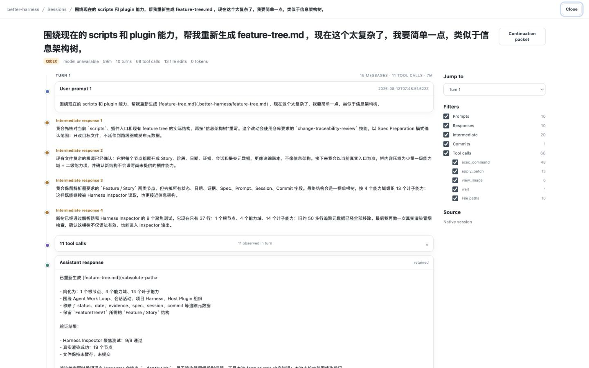
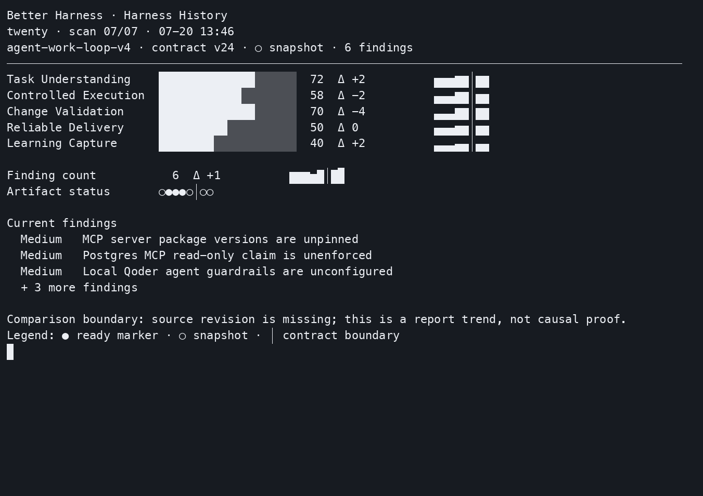
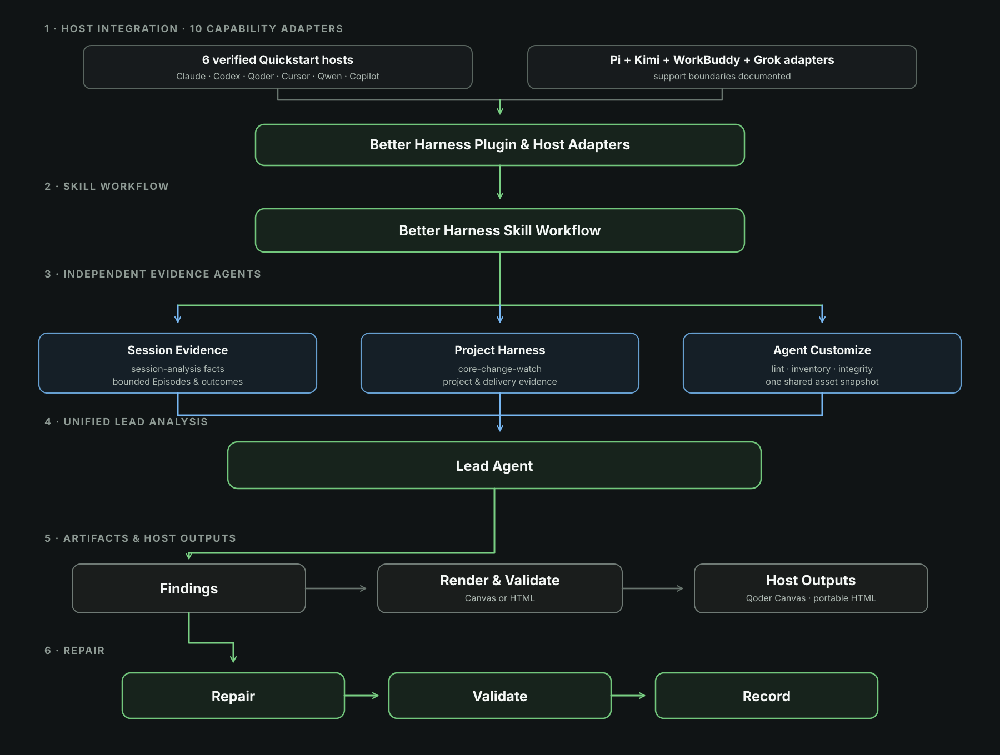

<h1 align="center">Better Harness</h1>

<p align="center">
  <a href="README.md">English</a> · 简体中文
</p>

<p align="center">
  <strong>把编码交给 Agent，用证据改进它背后的工作流。</strong>
</p>

<p align="center">
  Better Harness 为 Agent Work Loop 提供开源洞察。它通过你正在使用的 Coding Agent 运行，
  把项目与会话证据转化为有优先级的改进和可验证的下一步；没有观察到的证据会明确标注。
</p>

<p align="center">
  <a href="https://www.npmjs.com/package/@qoder-ai/better-harness"></a>
  <a href="LICENSE"></a>
</p>

<p align="center">
  <a href="https://qoderai.github.io/better-harness/zh-Hans/?utm_source=github&utm_medium=referral&utm_campaign=repository_landing&utm_content=readme_hero">中文网站</a> ·
  <a href="#quick-start">选择 Coding Agent</a> ·
  <a href="#see-it-in-action">示例报告</a> ·
  <a href="https://qoderai.github.io/better-harness/zh-Hans/docs/introduction">文档</a>
</p>

<a id="quick-start"></a>

## 快速开始

使用以下 Coding Agent 分析并改进你的工作流：[Claude Code](#claude-code)、[Codex Desktop](#codex-desktop)、[Codex CLI](#codex-cli)、[Qoder Desktop/CLI](#qoder)、[Cursor](#cursor)、[GitHub Copilot CLI](#github-copilot)。

选择你正在使用的宿主，查看对应的安装、验证、调用和报告输出说明。
不同宿主的入口并不完全相同，请直接使用对应章节给出的命令。

本 README 仅内联展示最常用宿主的安装步骤。其余受支持的宿主（Qwen Code、Pi、
Kimi Code、WorkBuddy 与 Grok）的步骤与边界保留在
[安装指南](docs/docs/installation.mdx)和[公开宿主适配矩阵](docs/docs/hosts/adapter-matrix.md)中；
参见[更多适配器](#更多适配器)。README 中的排布只是展示选择，并不代表支持等级。

Better Harness 会将行为断言限定在相关的任务过程片段（Task Episode）及其周边项目机制内。
Qoder 与 Cursor 生成宿主原生 Canvas 报告；Claude Code、Codex、Qwen Code、GitHub Copilot 和 Kimi Code 生成自包含的 HTML 报告及配套 Markdown。
缺失或不完整的证据会被明确标注。有关当前覆盖范围和输出差异，请参阅
[宿主适配器矩阵](docs/adapters/README.md)。

<a id="see-it-in-action"></a>

## 看看实际效果

报告会明确标注证据缺口，并将有证据支撑的问题整理成按优先级排列的发现；
每项发现都包含影响、预期输出、范围明确的修复方案与验收检查。

<p align="center">
  <a href="https://qoderai.github.io/better-harness/demo/better-harness-report/"></a>
</p>

<p align="center">
  <sub><a href="https://qoderai.github.io/better-harness/demo/better-harness-report/">打开完整的自包含英文 HTML 报告</a>
  （<a href="assets/demo/better-harness-report.html">源文件</a>）。</sub>
</p>

若要追踪交付链路，交互式 [Harness Inspector](https://qoderai.github.io/better-harness/inspector/)
会在一个只读工作区中，把产品意图与智能体活动、会话、文件和提交串联起来，
同时保持证据强度与局限清晰可见：

<p align="center">
  <a href="https://qoderai.github.io/better-harness/inspector/"></a>
</p>

<p align="center">
  <sub><a href="https://qoderai.github.io/better-harness/inspector/">打开交互式 Harness Inspector 示例</a>（使用虚构的英文数据，不会读取你的工作区）。</sub>
</p>

当你积累了多份可比较的历史报告后，历史视图会展示智能体工作闭环五个维度的变化：

<p align="center">
  <a href="dev/terminal-demo/README.md"></a>
</p>

这张静态最终帧汇总了历史 Harness 报告。它展示的是已记录的趋势，并不能证明改进之间存在因果关系。
[查看演示录制方式](dev/terminal-demo/README.md)。

<a id="why-better-harness"></a>

## 为什么选择 Better Harness？

AI 编码智能体修改代码很快，但围绕它们的工作流往往才是薄弱环节：

- 🎯 **目标模糊** —— 智能体信心十足地解决了错误的问题。
- 🧭 **执行路径随意** —— 工作沿着他人无法复现的路径推进。
- ✅ **只有“能运行”，没有证据** —— 验证不完整或完全缺失。
- 🚀 **速度压过保障措施** —— 审查与交付检查被绕过。
- 🧠 **经验没有沉淀** —— 同样的问题在下一个任务中再次出现。

只审查最终 diff 会遗漏这些系统层面的问题。Better Harness 分析的是 diff 背后的工作流：
它收集项目证据（以及宿主支持时的会话证据），评估五个相互关联的维度，
并将具体差距转化为按优先级排列的发现。每项发现都与证据、预期结果、修复边界和验证路径关联，
让团队能够一次改进一个问题。

<a id="how-better-harness-works"></a>

## Better Harness 如何工作

Better Harness 使用
[前馈与反馈](https://martinfowler.com/articles/harness-engineering.html#FeedforwardandFeedback)
闭环，把工作开始前可用的指引与智能体行动后可用的信号结合起来：

- **前馈指引** —— `AGENTS.md`、spec、Skill 和验收标准在智能体行动前为其指明方向。
- **反馈传感器** —— linter、测试、Hook 和评估智能体观察结果并帮助智能体自我纠正。

在这一闭环中，它评估交付过程的五个部分，也就是**智能体工作闭环（Agent Work Loop）**：

[](models/agent-work-loop.md)

| 维度 | 它回答的问题 | 支撑机制 |
| --- | --- | --- |
| **任务理解（Task Understanding）** | 智能体是否知道目标以及“完成”的含义？ | 规则、`AGENTS.md`、spec、`DESIGN.md` |
| **受控执行（Controlled Execution）** | 工作是否沿着受支持且可重复的路径进行？ | Skill、命令、MCP 工具、沙箱边界 |
| **变更验证（Change Validation）** | 是否有证据表明变更确实有效？ | 测试、lint、Hook、可观察的诊断信息 |
| **可靠交付（Reliable Delivery）** | AI 的速度是否绕过了质量检查或验收？ | 人工审查、审批、CI/CD、恢复路径 |
| **经验沉淀（Learning Capture）** | 下一个任务能否从本次任务中受益？ | Loop Discovery、可复用的 SDLC Skill、Memory |

运行 `/better-harness` 会建立一个以任务为边界的基线，并根据宿主生成可视化报告、
Markdown 报告或两者兼有。报告会整合五维概览、按优先级排列的发现、检测到的智能体资产和证据摘要。
每项发现都包含一个修复动作，用于起草范围明确、可供审查的修复计划。

Better Harness 坚持如实呈现：未观察到的行为会被明确标注，而不会被转化为缺乏依据的评分或断言。
当前检查通过，只能证明改进措施确实执行过；只有后续可比较的结果才能证明闭环确实有所改进。

<a id="what-is-open"></a>

## 开放了什么

Better Harness 开放了三个相互关联的层次，而不只是一个斜杠命令提示词：

- **工程实践** —— 覆盖
  [会话证据、项目 Harness、智能体定制和闭环工程](references/README.md)
  的证据与判断指南。
- **评估模型** —— 以任务为中心的
  [智能体工作闭环](models/agent-work-loop.md)，包括证据状态、发现、评分边界和纵向验证。
- **可运行实现** —— 规范的
  [`/better-harness` 工作流](skills/better-harness/SKILL.md)、证据收集器、分析器、渲染器和轻量
  [宿主适配器](docs/adapters/README.md)。

这三个层次共享同一条边界：已配置的资产可以证明某种机制存在，
但只有与任务关联的证据才能证明该机制被使用过，或确实改善了结果。

<a id="architecture"></a>

## 架构

[](docs/ARCHITECTURE.md)

该架构让三个证据域保持独立，直到主智能体进行统一分析。
每个结果都会保留可见的证据来源、责任归属和验证路径。

<a id="installation"></a>

## 安装

不同编码智能体的安装方式不同。除 Qoder CLI 可使用 Qoder Desktop 内置版本外，
需要为每个宿主单独安装 Better Harness。安装或更新插件后，请启动新的会话或任务，
让宿主重新加载插件清单。

### 检查并规划插件生命周期变更

独立 CLI 可以检查所有宿主的本地 Better Harness 安装证据，不访问远程注册表，
也不修改宿主配置：

```bash
better-harness plugin status --host all
better-harness doctor --platform all
```

在使用宿主原生 UI 或 CLI 前，可以先生成指定宿主的安装、更新或移除计划。
计划会把原生步骤保留为带类型的 argv 数据，供用户审阅后在外部有意执行；
人类可读视图不会把它们拼成 shell 命令字符串，Better Harness 也不会执行这些步骤：

```bash
better-harness plugin plan install --host qwen --surface cli --scope user
better-harness plugin verify --host qwen --surface cli
```

宿主差异会保持显式：Qoder Desktop 为内置分发；Cursor 在原生命令合同完成核对前
只保留会话级状态；Pi 缺少当前原生证据的生命周期操作会标记为手工或不可用；
WorkBuddy 没有可管理的 Better Harness 插件生命周期入口。

### Claude Code

将本仓库注册为 Claude Code Marketplace：

```text
/plugin marketplace add QoderAI/better-harness
```

然后安装 Better Harness：

```text
/plugin install better-harness@better-harness
```

通过 shell 验证插件是否已被发现：

```bash
claude plugin details better-harness@better-harness
```

详细信息应包含 `Skills (1) better-harness`。然后在需要分析的仓库中启动新的 Claude 会话，
并运行报告提示词：

```text
/better-harness 分析此项目的 AI 编码工作流并生成基于证据的报告
```

Claude Code 默认会在仓库的 `.claude/better-harness` 报告根目录下生成自包含的
`report.html`，以及配套的 `report.md` 和 `findings.json`。
如果希望结果只保留在聊天中，可以要求行内输出或不生成文件。
在可用时，报告会包含与工作区匹配的本地 Claude 会话；
缺失的证据会被明确标注，而不会依靠推断补齐。

### Codex

<a id="codex-desktop"></a>

#### Codex Desktop

1. 打开 **Settings > Plugins**。
2. 选择 **+ Add > From Marketplace**。
3. 输入 Git 仓库 URL，设置 Git ref；对于这个单插件仓库，**Sparse paths** 留空。
4. 选择 **Add marketplace**，然后从新 Marketplace 中安装 **Better Harness**。
5. 在需要分析的仓库中启动新任务，并运行报告提示词：

```text
@better-harness 分析此项目的 AI 编码工作流并生成基于证据的报告
```

仓库 URL 使用 `https://github.com/QoderAI/better-harness.git`，Git ref 使用 `main`。


<a id="codex-cli"></a>

#### Codex CLI

添加仓库源：

```bash
codex plugin marketplace add \
  'https://github.com/QoderAI/better-harness.git' \
  --ref main
```

然后查看并安装 Better Harness：

```bash
codex plugin list --marketplace better-harness
codex plugin add better-harness@better-harness
```

在需要分析的仓库中启动新的 Codex 任务，并运行报告提示词：

```text
$better-harness:better-harness 分析此项目的 AI 编码工作流并生成基于证据的报告
```

使用 `marketplace add` 时应传入仓库 URL，而不是原始 `marketplace.json` URL。
当前 Codex 版本使用 `plugin add` 和 `--marketplace`；
使用 `plugin install` 或 `--source` 的示例对应的是另一套 CLI 接口。

### Qoder

Better Harness 已内置于 [Qoder](https://qoder.com/) 桌面应用，因此无需通过 Marketplace
或本地插件安装。可以选择以下任一入口：

1. **从会话进入：** 打开需要分析的仓库，启动新会话，然后运行报告提示词：

   ```text
   /better-harness 分析此项目的 AI 编码工作流并生成基于证据的报告
   ```

2. **从 Quest 进入（Qoder 1.18.0+）：** 打开 Quest，然后从左侧边栏选择
   **Better Harness (Beta)**。

#### Qoder CLI

如果已安装 Qoder Desktop，Better Harness 在 Qoder CLI 中也已可用，
无需安装 Marketplace 或插件。在需要分析的仓库中启动新的 Qoder CLI 会话，
然后运行报告提示词：

```text
/better-harness 分析此项目的 AI 编码工作流并生成基于证据的报告
```

只有在未安装 Qoder Desktop、单独使用 Qoder CLI 时，才需要按照以下步骤手动安装：

##### 从 Marketplace 安装

```bash
# 添加插件 Marketplace 源
qodercli plugin marketplace add 'https://github.com/QoderAI/better-harness.git'

# 安装插件
qodercli plugin install better-harness@better-harness

# 检查安装
qodercli plugin list
```

##### 从 Git 安装

```bash
# 确保目录存在
mkdir -p $HOME/.qoder/plugins/marketplaces/

# 克隆仓库
git clone https://github.com/QoderAI/better-harness.git \
  $HOME/.qoder/plugins/marketplaces/better-harness --depth 1

# 安装插件
qodercli plugin install $HOME/.qoder/plugins/marketplaces/better-harness
```

在 Qoder CN 系列中，把 urls 中的 `.qoder` 替换为 `.qoder-cn`。

然后启动新的 Qoder CLI 会话，再使用 `/better-harness`。

### Cursor

Cursor 插件尚未发布到 Marketplace。仓库包含源码本地 manifest，但当前本机
Cursor help 没有验证历史 `--plugin-dir` 合同，因此 Better Harness 会把安装计划
标记为不可用，而不会输出该命令：

```bash
git clone https://github.com/QoderAI/better-harness.git
better-harness plugin plan install --host cursor --surface agent --scope session
```

Cursor 会话证据来自与工作区匹配的会话记录、元数据和审计日志。
通过其他已验证原生路径加载的会话可以运行 `better-harness plugin verify --host
cursor --surface agent`；覆盖范围不完整或不可用时会被明确标注。

### GitHub Copilot

将本仓库注册为 Copilot 插件 Marketplace，然后安装 Better Harness：

```bash
copilot plugin marketplace add QoderAI/better-harness
copilot plugin install better-harness@better-harness
```

验证 Skill 已加载：

```bash
copilot plugin list
```

请优先使用 Marketplace 安装。Copilot CLI 已弃用直接从仓库、URL 或本地路径安装。

Copilot 会话证据来自 `~/.copilot/session-state/` 下与工作区匹配的 Copilot CLI 会话记录。
Copilot 不记录逐次响应的 token 用量，VS Code Copilot Chat 也没有受支持的持久化会话记录；
两者均作为明确的证据边界保留。

### 更多适配器

除上述宿主外，Better Harness 还支持 Qwen Code、Pi、Kimi Code、WorkBuddy 与
Grok。它们确切的安装、调用与证据边界都放在文档里，以保持本 README 精简：

- **Qwen Code** —— [安装指南](docs/docs/installation.mdx#qwen-code)
  （`qwen extensions install QoderAI/better-harness`）。
- **Pi** —— [宿主适配器矩阵](docs/docs/hosts/adapter-matrix.md#pi)
  （`pi install <source>` 或 `pi -e <source>`）。
- **Kimi Code** —— [宿主适配器矩阵](docs/adapters/README.md)
  （`.kimi-plugin/plugin.json` 插件安装）。
- **WorkBuddy** —— [宿主适配器矩阵](docs/docs/hosts/adapter-matrix.md#workbuddy)。
- **Grok** —— [宿主适配器矩阵](docs/docs/hosts/adapter-matrix.md#grok)。

它们都产出自包含的 `report.html` 及配套的 `report.md` 与 `findings.json`；
缺失或不完整的会话证据会被明确标注。

<a id="develop-and-package-from-source"></a>

## 从源码开发和打包

开发环境需要 Node.js `>=22.20.0 <25.0.0` 和 npm
`>=10.9.3 <12.0.0`，支持 Windows、macOS 和 Linux。

```bash
npm ci
npm test
npm run pack:verify
```

使用以下命令构建源码中的 Codex 本地插件产物：

```bash
node scripts/packaging/build-host-plugin.mjs
```

通过验证的产物会写入 `dist/plugins/better-harness`。

在同一份源码检出中，可以使用以下命令检查仓库证据，而不读取本地会话：

```bash
node scripts/better-harness.mjs report --no-sessions
```

在源码检出目录中，`npm run preview -- --open` 会提供一个内置测试样例（fixture）。
Canvas 预览需要已安装的 Qoder 运行时，或显式指定 `--sdk-media`/`--sdk-root` 路径。
服务默认监听 `127.0.0.1`；它是本地检查工具，不是带身份验证的共享服务。

<a id="contribute"></a>

## 参与贡献

你无需理解整个运行时即可参与贡献。请从与你希望改进的内容最匹配的最小范围入手：

| 可贡献的内容 | 从这里开始 | 示例 |
| --- | --- | --- |
| 工作流指导与工程实践 | [`skills/`](skills/) 或 [`references/`](references/) | 为某种语言、框架、审查模式或重复出现的智能体工作流添加有来源支撑的指南。 |
| 评估模型与可执行分析 | [`models/`](models/) 或 [`scripts/`](scripts/) | 添加由证据支持的评估视角、检测器，或带 fixture 和测试的智能体友好分析命令。 |
| 交付控制与宿主支持 | [`hooks/`](hooks/) 或[新增 Coding Agent 指南](docs/adapters/contributing-new-coding-agent.md) | 添加范围明确的生命周期检查，或记录并验证另一种 Coding Agent 宿主的证据支持情况。 |
| 报告与视觉语言 | [`templates/reporting/`](templates/reporting/) 或 [`templates/style/`](templates/style/) | 添加报告模式、可复用的报告契约，或带验证证据的纯指令式视觉样式。 |
| 示例与运行模型 | [`case-studies/`](case-studies/) | 分享经过脱敏且以证据为边界的示例，展示团队如何应用 Agent Work Loop 分析与交付实践。 |

开始贡献：

1. 阅读[社区扩展地图](docs/community.md)，找到规范的归属位置并了解相应契约。
2. 按照[贡献指南](CONTRIBUTING.md)设置项目并确定变更范围。
3. 如需新增宿主支持，请遵循[新增 Coding Agent 贡献指南](docs/adapters/contributing-new-coding-agent.md)，
   并更新[宿主适配器矩阵](docs/adapters/README.md)。
4. 当贡献会改变运行时行为或渲染输出时，添加测试、fixture 或预览证据。
5. 提交一个聚焦的 Pull Request，说明改了什么、为什么修改以及如何验证。

不确定某个想法应该放在哪里？在创建新的顶层功能区，或修改公共报告、schema、打包或兼容性契约之前，
请先[创建 issue](https://github.com/QoderAI/better-harness/issues)。

<a id="license"></a>

## 许可证

Better Harness 采用 [MIT 许可证](LICENSE)。

---

<p align="center">
  如果 Better Harness 帮助你改进了智能体工作流，欢迎点一个 ⭐——这会帮助更多人发现本项目。
</p>
