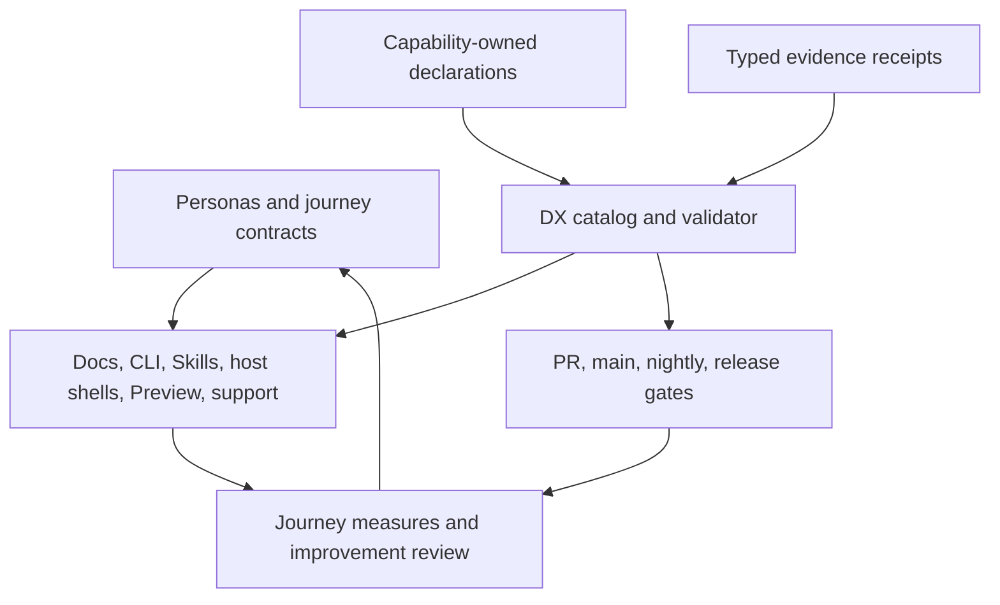

# ADR: Developer Experience System

## Status

Proposed. Decision date: 2026-07-31. Revision: 2026-07-31.

This ADR defines a target architecture. It does not claim that the target
registries, schemas, commands, evidence receipts, governance rules, or metrics
already exist. Each non-trivial implementation slice requires a dated spec,
stable acceptance criteria, risk evidence, and the validation appropriate to
the affected capability.

Acceptance requires the validation gate at the end of this ADR and an explicit
maintainer decision. Accepting this ADR approves the target architecture only;
it never activates a target owner. Existing canonical owners remain
authoritative until an implementation spec records a per-slice cutover in the
activation ledger defined below. A missing ledger entry always means "keep the
existing owner."

## Traceability

- ADR ID: `ADR-0002`
- Related spec:
  [Define the Developer Experience System](../specs/2026-07-31-developer-experience-system.md)
- Decision owner: Better Harness maintainers
- Applies to: public product entrypoints, CLI and machine contracts,
  documentation, local development, Preview, Coding Agent host support,
  diagnostics, native evidence, CI, release, support, security, and DX
  measurement
- Supersedes: no prior repository-wide DX decision
- Related local decision:
  [AI-Optimized Directory Structure](directory-structure.md)

## Context and Problem Statement

Better Harness already has strong local DX components: bilingual documentation,
host-specific entrypoints, audience-layered CLI help, machine-readable output,
cross-platform tests, package verification, Preview tooling, evidence-first
adapter guidance, Specs, and review gates. The components do not yet behave as
one system.

The same product fact can currently appear in host manifests, command parsers,
CLI help, adapter matrices, README sections, Docusaurus pages, issue forms,
tests, changelog entries, and release workflows. Those copies can agree with
each other while still being stale. A command group can look discoverable at the
root while a leaf command treats `--help` as runtime input. A deterministic
fixture can pass while a native host path is broken. A public support label can
remain current after its native evidence is no longer current. A successful
collector can also be confused with a collector that failed and was silently
downgraded.

This creates different failure modes at different developer levels:

- evaluators cannot always distinguish a host-integrated report path from a
  source or probe CLI;
- operators can install a surface without knowing how to verify, invoke,
  recover, update, remove, or find its output;
- first-time contributors can run root tests but may not discover the separate
  documentation build or the smallest change-specific gate;
- experienced contributors can find the capability owner but still encounter
  inconsistent leaf-command contracts and hidden local runtime dependencies;
- adapter authors have a good evidence checklist but must propagate host facts
  manually across many surfaces;
- maintainers have broad CI and package checks but no single chain from a public
  claim to fresh native evidence and a protected release;
- support and security responders lack one bounded, redacted diagnostic
  contract and a private disclosure path.

The architecture must make a public experience claim traceable without moving
all product judgment into a new central monolith.

## Relationship to the DX Fluency Model

This decision uses the external DX Fluency Model cited in the related spec as a
diagnostic lens. Its five pillars apply to every journey:

1. documentation experience;
2. error presentation;
3. usability;
4. interaction design;
5. touchpoints and support.

The model's Awareness, Focus, Execution, Optimization, and Reinforcement stages
describe organizational maturity. They are not release scores, command exit
codes, or report thresholds.

This ADR governs Better Harness's own developer experience. It is separate from
the repository's [Software Fluency model](../../models/software-fluency.md),
which is a runtime analysis lens for reviewed repositories. Adding a new model
to report routing would require a separate spec, fixtures, model registration,
and report-contract tests.

## Decision Drivers

- A developer should complete a task without reconstructing hidden product
  boundaries from source code.
- Humans, agents, CI, documentation, and support surfaces should project the
  same structured facts.
- The capability that implements behavior must continue to own its semantics.
- Human explanations and translations must retain an identifiable author and
  must not be overwritten by deterministic generators.
- Fixture, package, native-host, installed-application, browser, deployed-site,
  and release evidence must remain distinguishable.
- Failure, partial success, empty results, unsupported scope, missing authority,
  and unobserved state must not collapse into one value.
- Default operation must remain local-first, privacy-preserving, read-bounded,
  and cross-platform.
- Adoption must be incremental, reversible, and useful before every target
  component exists.
- Public support and release claims must become weaker automatically when their
  required evidence is absent or stale.
- DX improvement must be measured through task completion and recovery, not
  artifact counts or a single vanity score.

## Decision Layers and Change Authority

This ADR deliberately separates durable invariants from versioned contracts and
operating policy. Accepting the ADR makes only the invariant column normative.
It does not activate a target path or freeze every illustrative v1 field.

| Area | Durable ADR invariant | Delegated versioned contract or policy | Change authority |
| --- | --- | --- | --- |
| Ownership | Product judgment remains with business capabilities; the DX catalog is judgment-free | Declaration discovery and activation-ledger formats | Compatible changes use a dated implementation spec; moving judgment requires an ADR revision |
| Journeys | Experience is evaluated by persona, the `DX-J1` through `DX-J9` core taxonomy, required journey fields, and all five DX pillars | Versioned operational instances, additive non-core journeys, review cadence, and individual target values under `docs/dx/` | Operational/additive changes use a dated spec; reusing/removing a core id, changing its completion meaning, removing a required field, or removing a pillar requires an ADR revision |
| Commands | One typed owner drives parser, help, schema, effects, diagnostics, and conformance; recognized machine mode returns one parser-safe versioned envelope for every outcome | `command-contract.v1`, diagnostic taxonomy, field nullability, numeric exit mapping, and machine-envelope versions | Compatible fields use a spec; breaking versions require a migration spec; changing stdout cardinality, weakening strictness/effect disclosure, or moving recognized machine failures out of the envelope requires an ADR revision |
| Host support | Support is slice-based, evidence-backed, freshness-aware, and automatically demoted | `host-support.v1`, profile predicates, and per-host freshness policies | Slice and predicate evolution uses versioned policy plus migration; accepting synthetic evidence as native evidence requires an ADR revision |
| Evidence | Evidence classes do not substitute for one another; receipts are immutable and privacy-bounded | `evidence-receipt.v1`, class taxonomy, producer payloads, and redaction profiles | Compatible fields use a spec; taxonomy or privacy-invariant breaks require an ADR revision or successor |
| Documentation and accessibility | Curated prose remains author-owned; structured facts are projected; every public surface owns accessibility | Projection formats, locale parity checks, and accessibility test profiles | Surface implementations use dated specs; generated prose or removal of accessibility ownership requires an ADR revision |
| Privacy and support | Default operation is local-first, telemetry-free, bounded, and explicit before persistence or network send | Privacy, support-version, retention, and support-bundle policies | Tighter compatible policy uses review; new default network collection or telemetry requires a separate ADR |
| Release | Publication is planned from a protected immutable revision, applied without plan mutation, and verified from the real distribution surface | Release manifest, required checks, provenance format, and evidence freshness policy | Workflow evolution uses a release spec; arbitrary-ref publishing requires an ADR revision |
| Measurement | Journey outcomes retain failures and unobserved coverage; no single score approves release | Metric definitions, populations, targets, and retrospective cadence | Metric changes use reviewed policy; default remote measurement requires a separate ADR |

The durable-invariant column is the only normative authority created by ADR
acceptance. Later sections either explain those invariants or label proposed v1
details delegated to a versioned contract; they do not silently create another
authority tier.

Versioned contracts may evolve inside these invariants. A backward-compatible
minor revision requires its owning implementation spec, fixtures, and consumer
evidence. A breaking major revision also requires a migration and compatibility
window. Any change that contradicts an invariant, transfers business judgment
to the catalog, weakens privacy or evidence classes, or changes default network
behavior requires an explicit revision of this ADR or a superseding ADR.

Target-owner activation is orthogonal to both ADR acceptance and contract
publication. Each fact slice moves only through `planned`, `shadow`,
`authoritative`, `compatibility`, and `retired` states in the activation ledger.

## Scope

This ADR owns the cross-cutting contract that connects:

- product route selection and first-use expectations;
- role and journey completion definitions;
- structured host-support and command declarations;
- error, diagnostic, side-effect, and privacy contracts;
- curated prose, structured projections, and evidence views;
- local setup, focused checks, Preview, and contribution routing;
- deterministic, package, native, deployed, and release evidence;
- CI, promotion, release, support, security, and rollback gates;
- privacy-safe DX measures and improvement reviews.

It coordinates those owners; it does not replace them.

## Non-goals

- Creating a new runtime maturity or report-scoring model.
- Building a generic `scripts/core/` or a central `dx.yaml` that owns all
  product behavior.
- Making every host expose the same native capabilities or hiding unsupported
  capability slices behind a lowest-common-denominator interface.
- Generating conceptual guidance, troubleshooting judgment, or translations
  from structured data.
- Treating synthetic CI as proof of native installation, host discovery, full
  report generation, desktop rendering, or deployed-site health.
- Enabling remote telemetry, uploading diagnostics, or sending support data by
  default.
- Implementing every target directory or command in the same change as this
  decision.
- Deleting compatibility commands, user configuration, reports, caches, or host
  state as part of a migration.

## Terms

| Term | Meaning |
| --- | --- |
| Journey | A bounded user or contributor task with a declared start, completion condition, recovery route, evidence source, and owner |
| Experience surface | A user-visible or machine-visible interface such as documentation, CLI, Skill, host shell, Preview, issue form, package, or release |
| Declaration | Structured facts owned by the capability responsible for their meaning |
| DX catalog | A read-only index of declaration locations and versions; it references owners and does not copy their judgment |
| Projection | A deterministic structured representation derived from declarations, such as help, schema, a support table, or an issue-form option list |
| Curated prose | Human-authored explanation, examples, recovery judgment, and translation |
| Evidence receipt | A bounded, sanitized record that states what was observed, where, when, against which revision, and what remained unobserved |
| Promotion | A change to a public support or release state after its required contract and evidence gates pass |
| Freshness | The validity window declared by an evidence policy and recorded explicitly in a receipt |
| Drift | A difference between a canonical declaration and a checked public projection or claim |
| Unobserved | Evidence was not collected or was not applicable; it is neither success, failure, nor numeric zero |

## Personas and Developer Levels

The system uses persona names instead of assuming that one numeric skill level
applies to every task. A maintainer can still be a first-time operator for a new
host.

| Persona | Primary question | Required system response |
| --- | --- | --- |
| Evaluator | Is this product applicable, supported, and safe for my environment? | Honest product routes, support slices, prerequisites, sample boundary, and data-use summary |
| Operator | Can I install, verify, run, recover, update, and remove it? | One complete host-native journey with expected output and safe recovery |
| First-time contributor | Can I move from clone to a reviewable green change? | Small owner routes, focused checks, docs path, Preview path, and PR evidence guidance |
| Experienced contributor | Can I change a capability without reading unrelated internals? | Public module boundaries, typed command contracts, fixtures, and fast feedback |
| Adapter author | Can I add one host slice without overclaiming the others? | Federated host declarations, scaffold/conformance routes, native evidence, and promotion rules |
| Maintainer and releaser | Can I prove what is safe to merge, publish, and roll back? | Required gates, evidence freshness, release plan, protected apply, and post-publish verification |
| Support and security responder | Can I diagnose a problem without collecting secrets or raw sessions? | Bounded diagnostic plan, redaction, explicit persistence or upload, support lifecycle, and private disclosure |

## Journey Contracts

Every journey must declare its owner, entry surface, prerequisites, observable
completion, safe recovery, privacy boundary, evidence class, and measurement.

| ID | Journey | Observable completion |
| --- | --- | --- |
| `DX-J1` | Evaluate | The evaluator can select host-integrated use, CLI use, or source contribution; identify current support and limitations; and understand reads, writes, and network behavior |
| `DX-J2` | Install and verify | The selected surface is installed and a host-native inspection or read-only diagnostic confirms the intended version and capability slice |
| `DX-J3` | Reach first value | The correct host invocation or CLI command completes and the user can open the declared report or artifact |
| `DX-J4` | Recover from failure | A stable diagnostic distinguishes invalid input, missing authority, unsupported scope, unavailable dependency, empty evidence, collector failure, and malformed output; the user can retry safely or prepare bounded support evidence |
| `DX-J5` | Update, roll back, or remove | The user can preview compatibility, update or pin a version, roll back when supported, uninstall the surface, and locate any retained reports or caches |
| `DX-J6` | Make a first contribution | A contributor can clone, select the owner, run the smallest focused gate, preview when relevant, and open a PR whose evidence matches the changed scope |
| `DX-J7` | Extend a capability or host | The author can prepare a spec, implement one owned slice, run fixtures and conformance, attach native evidence when claimed, update projections, and request promotion without broad search-and-copy work |
| `DX-J8` | Release and verify | A maintainer can plan from a protected revision, verify version and evidence, publish immutable artifacts, install from the real distribution surface, and roll back or deprecate deliberately |
| `DX-J9` | Support or disclose | A user can create a redacted reproduction, choose public support or private security disclosure, understand retention, and receive a stable next action |

The following routing matrix instantiates the required journey fields for this
decision. This ADR permanently owns the core ids, core completion meanings,
required fields, and removal rules. Future operational detail moves to the
target versioned journey catalog under `docs/dx/` only through the activation
ledger; until then, this table owns both layers.

| ID | Primary personas | Current owner and entry surface | Prerequisite | Recovery route | Privacy and evidence boundary | Measure owner |
| --- | --- | --- | --- | --- | --- | --- |
| `DX-J1` | Evaluator, Operator | Root README, curated site introduction, and public host matrix | A candidate host or CLI/source intent | Installation chooser and support matrix | Public structured facts and bounded sample artifacts only | Target DX metric policy; unobserved until a metric spec lands |
| `DX-J2` | Operator | Host shell or native install route plus installation guide; target host profile and `doctor` contribute verification | Supported host/version and authority to install | Host-specific recovery and read-only diagnostic | Install/discovery receipt; no raw sessions required | Host-support owner supplies facts; DX metric policy owns definition |
| `DX-J3` | Operator | Canonical Skill/output contract or capability-owned CLI command | Verified entrypoint, qualified workspace, and declared evidence scope | Stable command diagnostic and artifact-discovery guidance | Report/output receipt; session data remains within declared capability scope | Report/command capability supplies event; DX metric policy owns definition |
| `DX-J4` | Operator, Support responder | Command capability diagnostics and troubleshooting guidance | A reproducible failed or partial attempt | Code-specific safe retry, bounded support plan, or private disclosure | Redacted diagnostic envelope; failure and unobserved lanes retained | Diagnostic capability supplies codes; DX metric policy owns recovery measure |
| `DX-J5` | Operator | Native host install owner, package owner, and support policy | Installed version and supported update/removal mechanism | Pin, rollback, reinstall, or explicit retained-data cleanup | Package/host evidence only; no deletion of reports or config without explicit scope | Host/package owner supplies lifecycle event; DX metric policy owns definition |
| `DX-J6` | First-time contributor | `CONTRIBUTING.md`, root package tasks, Preview route, and PR template | Supported Node/npm, clone, and selected change owner | Baseline-failure recording, focused troubleshooting, and maintainer help | Repository/fixture evidence; no private host state in PRs | CI supplies deterministic timing; DX metric policy owns population |
| `DX-J7` | Experienced contributor, Adapter author | `AGENTS.md`, architecture, community matrix, capability owner, and host guide | Matching dated spec when required and explicit claimed slices | Conformance failures, advisory native evidence, and rollback owner | Fixture, package, and native evidence stay separately typed | Capability/host owner supplies gates; DX metric policy owns definition |
| `DX-J8` | Maintainer, Releaser | Package/packaging owners and protected release workflow | Accepted release plan, immutable revision, fresh claim evidence, and authority | Abort plan, withdraw artifact, roll back, or deprecate | Release snapshot references immutable digests; post-publish evidence is separate | Release owner supplies events; DX metric policy owns definition |
| `DX-J9` | Operator, Support and security responder | Troubleshooting and issue routes; target `SUPPORT.md`, `SECURITY.md`, privacy policy, and support-bundle capability | User-selected public support or private disclosure route | Redacted plan, explicit persistence/send, deletion route, and responder handoff | No raw source/session/credential defaults; upload is separate external apply | Support owner supplies demand category; DX metric policy owns definition |

Each journey is reviewed through all five DX pillars. A journey does not pass
because only its documentation exists or only its deterministic tests pass.

After the journey catalog activates, contributors use these non-overlapping
edit routes:

- add an operational field or change an owner, entry surface, prerequisite,
  recovery route, evidence mapping, or stable metric-id binding in the versioned
  `docs/dx/` instance through a dated spec;
- add or change a metric definition, population, numerator, denominator,
  sampling boundary, privacy class, cadence, or decision consumer only in the
  separately versioned DX metric-policy registry under `docs/dx/`;
- add a non-core journey with a new id in the versioned catalog through a dated
  spec and explicit persona mapping;
- revise this ADR to remove, reuse, or change the completion meaning of
  `DX-J1` through `DX-J9`, remove a required field, or change the five-pillar
  rule.

Validation requires every core id exactly once in the active catalog, rejects
any operational instance that changes its ADR-owned completion meaning, and
requires every metric-id binding to resolve to exactly one active metric-policy
definition for that journey. Journey instances may not embed metric definitions.
The ADR does not duplicate later operational values.

## Decision

### 1. Use a federated DX control plane

**Durable invariant.**

Better Harness will implement DX as a control plane for contracts, validation,
projection, evidence, promotion, and measurement. Runtime behavior remains in
business-named capabilities.



The DX catalog may locate declarations, validate schemas, compare projections,
and produce deterministic output. It must not decide host semantics, command
behavior, privacy policy, report meaning, or release support by itself.

### 2. Keep facts with federated canonical owners

**Durable invariant.** The ownership and conflict rules in this subsection
govern every contract version; individual declaration shapes are delegated.

| Fact type | Canonical owner | Allowed projections |
| --- | --- | --- |
| DX personas, core journey taxonomy/completion, required fields, pillars, and removal rules | This ADR | Core-catalog validation and architecture review routes |
| Versioned journey instances, additive non-core journeys, operational owners/routes, and stable metric-id bindings | Target journey catalog under `docs/dx/` after activation | Journey checklists, review templates, and metric-binding views |
| Metric ids, definitions, populations, numerators, denominators, sampling boundaries, privacy classes, cadence, and decision consumers | Target DX metric-policy registry under `docs/dx/` after activation | Journey measurement views, retrospective reports, and release/support decision inputs |
| Host-integrated route and completion facts | The canonical Skill/output contract plus the host-support profile for the selected host | README/site route cards, installation chooser, host-specific next step |
| CLI route and completion facts | The capability-owned command contract for each exposed outcome | CLI help, command inventory, reference facts, next-step output |
| Source-contribution route facts | `CONTRIBUTING.md` for curated workflow and root package tasks for executable commands | Contribution entrypoints and task reference |
| Host identity, aliases, capability slices, invocation, install, output, and support state | A target `host-support` capability plus native adapter evidence | Adapter matrix, Quickstart set, issue forms, command choices, support status |
| Command options, audience, I/O, mutability, side effects, examples, errors, aliases, and deprecations | The command's capability-owned public contract; the existing root CLI registry indexes it | Parser, help, command inventory, OpenCLI schema, conformance tests, reference facts |
| Public npm package identity and version | Root `package.json` | npm installation facts, release plan, artifact metadata |
| Native host-shell identity and compatibility version | The relevant native host manifest, with its relationship to the root release validated explicitly | Host discovery facts and native package metadata |
| Shared evidence envelope, class taxonomy, compatibility, and redaction invariants | Target evidence-contract capability and its versioned public schema | Cross-producer validators, evidence views, freshness gates |
| Native observation payload | Runtime-smoke producer and immutable sanitized evidence receipt | Support badges, evidence views, freshness gates, release plan |
| Reads, writes, network use, sensitive fields, and retention | The implementing capability contract, constrained by the target repository privacy policy | Preflight summaries, `doctor`, support plan, privacy tables |
| Human explanation and translation | The relevant README, canonical guide, curated site page, or locale owner | Semantic consistency checks only; no generated replacement prose |
| Release truth | Protected Git revision, tag, release manifest, produced artifacts, real registry, and post-publish receipt | Download/install page, compatibility statement, release notes |

When two surfaces need the same structured fact, they must consume or validate
the same declaration. They must not establish a second canonical list in a test
or documentation file.

Product routes are composed views, not new judgment owned by the DX catalog.
Every projected route field carries the id and version of its contributing
capability declaration. The catalog rejects missing owners, multiple
authoritative contributors for one field, and contradictory values; it has no
precedence rule that lets it choose a winner. Conflict resolution happens in a
dated spec owned by the conflicting capabilities before projection resumes.

### 3. Separate the three product routes

**Durable invariant.**

The public experience must distinguish:

1. **Host-integrated workflow:** a host installs or discovers the canonical
   Skill and can run the report loop supported by that host's declared slices.
2. **CLI workflow:** the CLI exposes only the outcomes its implementation
   actually completes. A command named `report` must produce a report; an
   evidence probe or host handoff is named `probe` or `prepare`. Changing the
   existing command requires a compatibility alias and deprecation window.
3. **Source-contribution workflow:** a repository checkout exposes development,
   focused testing, documentation, Preview, packaging verification, and
   maintainer commands. It must not be presented as an installed end-user path.

A future standalone full-report CLI may be promoted only when a separate spec
demonstrates install, verification, report production, output discovery,
recovery, update, removal, package, and cross-platform evidence.

### 4. Define a common command contract

**Durable invariant:** every command has one typed capability owner, strict and
side-effect-free discovery, declared effects, parser-safe machine behavior, and
versioned compatibility. Exact v1 fields and numeric exit values below are
delegated proposals.

Every public or maintainer command must declare:

- stable command id and contract version;
- capability owner and public entrypoint;
- `workflow`, `advanced`, or `maintainer` audience;
- purpose, examples, aliases, and deprecation state;
- typed options, defaults, enums, conflicts, required values, and explicit
  passthrough boundary;
- accepted input scopes and validation rules;
- output schema and artifacts;
- mutability: `read-only`, `plan`, `apply`, or `external`;
- filesystem reads and writes, network behavior, sensitive fields, and
  retention;
- success, partial, failure, and stable diagnostic codes;
- focused tests and documentation owner.

Contract rules:

- Unknown flags, extra positionals, and missing option values fail by default.
- Boolean options parse explicit true and false values or reject that syntax;
  string truthiness is never a boolean parser.
- `--help` exits zero and performs no workspace scan, host probe, network call,
  or write.
- `command describe` resolves a leaf command, not only its parent group.
- Human output is concise and actionable. Machine output is parser-safe and
  contains no progress, color, spinner, or unrelated diagnostics on stdout.
- Input paths are validated for existence, expected type, qualification, and
  safe real-path scope before analysis.
- Empty evidence, missing authority, unsupported scope, collector failure,
  invalid child output, and invalid input have distinct stable codes.
- Mutation uses plan then apply. External or destructive actions require
  explicit authority and non-interactive confirmation semantics.
- Help, parsers, machine schema, reference facts, and conformance tests derive
  from the same typed contract.

**Cross-version machine rule:** machine mode has a bootstrap parser that
recognizes an exact `--json` global-option token before capability parsing. It
may appear anywhere in the parent command's arguments before the first explicit
`--` passthrough terminator. Tokens after `--` belong exclusively to the child
or external command and are never interpreted by the parent bootstrap parser.
Once machine mode is recognized, every normal completion, partial
completion, usage error, preflight error, and operational failure emits exactly
one versioned JSON document on stdout. Stderr may contain bounded process or
developer diagnostics, but consumers never need it to interpret the result and
it never contains a second envelope. `--jsonl` is a separate declared stream
contract and cannot silently reuse the single-document contract.

**Proposed `command-contract.v1` detail:** the first version should use this
nullability and artifact behavior:

- `ok`: `data` matches the command output schema, `artifacts` is an array, and
  diagnostics may be empty;
- `partial`: usable `data` is present, `artifacts` contains only materialized
  outputs, and at least one diagnostic names every missing or degraded lane;
- `failed`, including invalid usage after machine mode is recognized: `data` is
  `null`, `artifacts` is empty unless a retained partial artifact is explicitly
  marked incomplete, and at least one error diagnostic supplies a stable code
  and safe next action;
- optional fields are omitted according to the schema, never represented by an
  undocumented mix of missing, empty, zero, and `null`.

For proposed v1, if argument bytes are malformed before the bootstrap parser can
recognize an exact machine-mode token, the process uses bounded human usage text
on stderr and exit `64`. If the process cannot serialize the versioned envelope
after machine mode is recognized, it emits no misleading JSON, exits `1`, and
writes the fixed transport diagnostic `ENVELOPE_SERIALIZATION_FAILED` to stderr.
This last-resort transport failure is covered by a dedicated conformance
fixture. A later major contract may change the numeric mapping or diagnostic
name, but it cannot return a parseable-looking partial envelope or violate the
cross-version machine rule.

Conformance covers `--json` before and after a leaf command, reordered global
flags, `-- --json`, missing option values followed by `--json`, and explicit
child-command passthrough. Only pre-terminator global tokens can select the
parent machine contract.

The following JSON shape is an illustrative proposal for
`command-contract.v1`, not an activated schema owned by this ADR:

```json
{
  "schemaVersion": "1",
  "command": "better-harness doctor",
  "status": "ok",
  "data": {},
  "artifacts": [],
  "diagnostics": [
    {
      "code": "HOST_NOT_DISCOVERED",
      "severity": "warning",
      "message": "The selected host was not discovered.",
      "hint": "Install the host or choose a different platform.",
      "docsUrl": "https://qoderai.github.io/better-harness/docs/troubleshooting"
    }
  ],
  "meta": {
    "durationMs": 42,
    "sideEffects": "read-only"
  }
}
```

The proposed v1 exit mapping is intentionally small and portable:

- `0`: `ok`;
- `2`: `partial`, with usable data and explicit missing lanes;
- `1`: operational `failed`;
- `64`: invalid command usage before product work begins.

The stable diagnostic code, rather than the numeric exit value alone, carries
the actionable failure category.

### 5. Add a read-only diagnostic journey

**Proposed `harness-doctor.v1` target contract.** Its read-only, bounded,
local-first, and redacted behavior follows the durable privacy and command
invariants; exact fields belong to the implementation spec.

The target diagnostic entrypoint is:

```text
better-harness doctor --platform <host> --json
```

It reports the CLI and package version, supported runtime range, host discovery,
selected support profile, authorized roots, available evidence lanes, output
directory writability, Preview runtime discovery, and stable diagnostics.

It must be read-only by default, bounded in time, safe without a network,
machine-readable, and free of raw source, prompt, transcript, token, credential,
or full absolute user-path content. Optional deeper probes require explicit
flags and must state their reads before execution.

### 6. Separate curated prose, projected facts, and evidence views

**Durable invariant:** curated explanation remains author-owned and only
structured facts may be deterministically projected. The Quickstart template
and CI routing below are target documentation operating policy.

Documentation has three kinds of content:

1. **Curated prose:** concepts, explanations, examples, recovery judgment, and
   translations. Authors own this content.
2. **Projected facts:** host identifiers, versions, command flags, support
   slices, paths, and lifecycle states. Deterministic tools may generate or
   validate these facts.
3. **Evidence views:** last native verification, tested OS and host version,
   observed slices, evidence class, receipt link, and freshness.

Structured projections must record their owner and source. Generated files or
blocks must be clearly marked and must reject manual drift. Curated prose is
checked for semantic alignment with declarations but is not overwritten or
automatically translated.

Every host Quickstart follows one completion template:

```text
Prerequisites and supported versions
-> Install
-> Verify
-> Invoke
-> Expected success
-> Open artifact
-> Recover
-> Update, pin, roll back, or uninstall
-> Privacy and data use
-> Support
```

Short commands should be shell-neutral single lines. When syntax differs,
documentation provides separate Bash and PowerShell forms. English and
Simplified Chinese pages require structural and factual parity, not literal
sentence parity.

Pull requests that change the site, its configuration, assets, locale content,
or projected facts must run a production Docusaurus build before merge.
Deployment remains a separate post-merge action.

### 7. Make Preview a declared, diagnosable surface

**Proposed Preview target contract.** The durable boundary is that a default
contributor Preview may not hide an undeclared installed-host dependency.

The default Preview development journey must not silently depend on an installed
Coding Agent host. The target offers:

- a self-contained deterministic fixture path for ordinary contribution;
- explicit HTML and Canvas Preview commands;
- explicit runtime selection rather than hidden host discovery;
- a Preview diagnostic that reports the selected runtime and missing
  dependencies;
- stable health, module, and metadata endpoints;
- actionable browser-open failures with a copyable manual URL;
- fixture variants for minimal, dense, Simplified Chinese, long-path, missing
  evidence, partial, and error states;
- automated browser checks for desktop and mobile, light and dark themes,
  supported locales, console errors, page errors, and screenshots.

Preview does not read user sessions or modify host configuration by default.
Screenshots remain temporary or CI artifacts unless a user explicitly selects a
durable destination.

### 8. Treat accessibility as a surface-owned contract

**Durable invariant:** every public surface owns accessibility and cannot
substitute a generic unit-test pass for surface evidence. The following minimums
are proposed target accessibility policy owned by `docs/accessibility.md`.

Accessibility is owned by each experience surface, constrained by a target
repository accessibility policy under `docs/`. The DX catalog may index
conformance evidence but does not decide UI or content behavior.

Minimum public web, report, and Preview requirements are semantic structure,
keyboard reachability, visible focus, meaningful alternative text, zoom and
responsive reflow, WCAG AA text and control contrast, no color-only status, and
reduced-motion behavior. CLI requirements are no color-only meaning, useful
plain-text and non-TTY output, stable reading order, and a `--no-color` path
where color is otherwise emitted. Host-native surfaces document any host-owned
accessibility limitation instead of presenting it as a Better Harness guarantee.

Changed visual surfaces run deterministic semantic and contrast checks plus
keyboard, focus, reduced-motion, desktop/mobile, and screen-reader-oriented
manual review proportional to the change. Evidence is recorded as automated
web/accessibility test output, browser screenshots, and a bounded manual
checklist; it is not replaced by a generic unit-test pass. The accessibility
policy owns minimum requirements and evidence definitions, while the changed
surface owns remediation and its focused tests.

### 9. Model host support as slices and evidence-backed promotion

This subsection contains the labeled durable host/evidence invariant, proposed
`host-support.v1` and `evidence-receipt.v1` details, and target evidence operating
policy. Those authority layers may not be inferred from unlabeled examples.

Host support is not a boolean. Each host profile declares these independent
slices when applicable:

- native contract research and version boundary;
- installation and discovery;
- configured assets;
- session evidence;
- shared workflow activation;
- report/output loop;
- package or host-shell distribution;
- documentation, recovery, update, and removal.

**Durable invariant:** host support is slice-based, evidence-class aware, and
evaluated against a named profile and freshness policy. No single scalar host or
slice state may combine declaration, verification, and freshness.

**Proposed `host-support.v1` detail:** each host slice has one intrinsic
declaration disposition: `unsupported`, `declared`, or `withdrawn`. The slice
also references immutable evidence receipts without copying a derived
verification state into its declaration.

Verification results are keyed by host, slice, evidence class, contract
version, profile predicate version, and freshness-policy version. Each result is
`unobserved`, `passed`, `failed`, or `stale`. A documentation slice can therefore
pass documentation-build evidence without pretending to be native-verified,
and two concurrent profile versions can evaluate the same immutable receipt set
without changing the slice declaration.

Public support profiles are versioned predicates over required declaration
dispositions and keyed verification results. A predicate marks each slice
`required`, `optional`, or `omitted`; omission is profile evaluation behavior,
not an intrinsic slice state. For example, `adapter-support.v1` may require at
least one declared slice with deterministic fixtures and explicit dispositions
for every other slice. `public-quickstart.v1` requires fresh native installation
and discovery, workflow activation, report/output-loop, artifact-discovery,
documentation, recovery, and removal results; it may omit session evidence when
that profile version does not require it.

Promotion is computed from a named predicate; it is not a manually copied label
and a host does not traverse irrelevant states. Partial profiles remain valid
and visible without being promoted to a full Quickstart. Predicate changes are
versioned and cause deterministic re-evaluation rather than mutation of
historical declarations or receipts.

Profile evaluation does not collapse blockers into one `unverified` scalar. It
produces two axes plus required-slice reasons:

- `eligibility`: `eligible`, `ineligible`, or `withdrawn` from declaration
  dispositions;
- `verification`: `not-evaluated`, `verified`, `unobserved`, `failed`, or
  `stale` from keyed evidence evaluation;
- `blockers`: one stable reason per unsatisfied required slice, including the
  slice id, declaration disposition, evidence class, verification result,
  diagnostic code, and evidence reference when present.

An unsupported required slice yields `ineligible` with an `unsupported`
blocker. A declared slice without evidence stays `eligible` but
`unobserved`; a fresh failed receipt yields `failed`; expired otherwise-passing
evidence yields `stale`; a required withdrawn slice yields `withdrawn`. Only
`eligible` plus `verified` qualifies for promotion. Every public projection
preserves blocker categories instead of reinterpreting unsupported, failed,
unobserved, stale, or withdrawn as the same state.

Mixed required slices reduce deterministically while retaining every blocker:

1. Eligibility precedence is `withdrawn` over `ineligible` over `eligible`. Any
   required withdrawn slice therefore yields `withdrawn`; otherwise any required
   unsupported slice yields `ineligible`; otherwise the profile is `eligible`.
2. Verification is reduced across required declared slices. Precedence is
   `failed` over `stale` over `unobserved` over `verified`. If there are no
   required declared slices, it is `not-evaluated`.
3. Scalar summaries never remove blocker rows. Consumers use them for sorting
   and promotion only; diagnostics and public support views render every
   unsatisfied required slice.

Conformance fixtures cover all-passed, unsupported plus withdrawn, failed plus
stale plus unobserved, no declared required slices, optional-slice failure, and
predicate-version changes over the same immutable receipts.

**Proposed `evidence-receipt.v1` detail:** every native support claim references
a sanitized evidence receipt containing:

- schema version and receipt id;
- host id and host version;
- OS, architecture, and relevant runtime versions;
- Better Harness Git revision or immutable package version;
- observed capability slices and explicitly unobserved slices;
- isolated fixture or representative workspace classification;
- executed command or interaction identifier and exit outcome;
- artifact type and checksum when an artifact was produced;
- privacy checks and redaction result;
- evidence class, source, `observedAt`, issuance freshness-policy id and
  version, and issuance-time validity boundary;
- bounded failure details when verification did not pass.

Receipts never contain raw prompts, transcripts, credentials, tokens, source
content, or unredacted user-home paths. Raw logs remain local or short-lived CI
artifacts with an explicit retention policy.

Unit or fixture, package, native host, installed desktop or browser, deployed
site, and post-publish evidence use different evidence classes and cannot
satisfy each other's gates. Evidence receipts are immutable. A current support
projection records `evaluatedAt`, active freshness-policy id and version,
effective validity boundary, and result. It evaluates existing receipts against
the active policy; a policy change can demote a claim without changing the
receipt or its issuance-time policy metadata.

When required evidence no longer satisfies the active policy, the public
projection keeps its eligibility axis and reports `unobserved` for missing
evidence, `failed` for fresh negative evidence, or `stale` for expired
otherwise-passing evidence, with the corresponding required-slice blocker. It
never silently remains verified. Each host profile owns a versioned, risk-based
freshness policy rather than inheriting an arbitrary universal number of days.

**Target evidence operating policy:** the evidence-contract capability owns the receipt index schema, trust tiers,
digest and attestation rules, revocation semantics, and compatibility. Evidence
producers own only their class-specific observation payload and cannot promote
their own result to an official product claim.

Receipt storage and trust are explicit:

- local receipts live under ignored `.harness/state/` and are untrusted until a
  reviewed promotion step; they are never packaged or uploaded automatically;
- CI receipts are immutable job artifacts addressed by run id and digest, with
  the workflow's declared retention; passing CI alone does not make them
  official native evidence;
- official sanitized receipts and their append-only index live under the target
  `docs/dx/evidence/` owner, record artifact provenance and digest, and require
  maintainer attestation or an approved trusted runner;
- release manifests snapshot the exact receipt ids, digests, support-predicate
  version, and freshness-policy version used at publication. That historical
  snapshot is immutable even when live support later becomes stale.

The live support projection evaluates non-revoked official receipts against the
currently active policy. The release view reports what was verified at release
time and links to current support separately. Revocation never edits a receipt;
the append-only index records `revokedAt`, reason, authority, and optional
replacement. Current support ignores revoked receipts, while historical release
manifests retain the original digest and display the later revocation.

Community-provided receipts enter as `candidate` and cannot change an official
support profile. Promotion requires either reproduction by an approved trusted
runner or explicit maintainer attestation after provenance, privacy, command,
artifact, and claimed-slice review. Official sanitized receipts are retained
for the lifetime of every support or release claim that references them; raw
logs follow their shorter declared local or CI retention.

### 10. Provide level-appropriate contribution loops

**Target contribution operating policy.** It implements the durable persona,
journey, ownership, and evidence invariants without making every route equally
complex.

The contribution surface exposes progressively deeper routes:

- a short documentation-only route;
- a fixture or test route;
- a capability behavior route;
- a host-adapter route;
- a maintainer and release route.

Each route lists the owner, whether a spec is required, smallest focused check,
broader gate, Preview or native evidence requirement, generated outputs, and
review evidence. Full architecture and native-host matrices stay out of the
first-contribution critical path until the selected change needs them.

The target root task vocabulary distinguishes:

- a fast changed-scope check;
- focused tests by capability;
- quiet and watch feedback;
- the complete repository gate;
- the complete gate plus documentation production build;
- package verification;
- Preview diagnosis and visual verification.

Tests and fixtures should mirror capability ownership as the suite grows.
Shared workspace, host-home, report, command-runner, and evidence-receipt
builders belong in a documented test-support surface instead of being copied
through large test files.

### 11. Use staged CI, promotion, and release gates

**Durable invariant:** publishing is planned from a protected immutable
revision, apply does not mutate the plan, evidence classes match claims, and the
real distribution surface is verified. The stage table is target release
operating policy.

| Stage | Required responsibility |
| --- | --- |
| Pull request | Changed-scope and contract tests, CLI conformance, declaration/projection drift, documentation build when affected, cross-platform core matrix, and Review Readiness evidence |
| Main | Full suite, package verification, projection consistency, deploy candidate, and merge-state evidence |
| Nightly | Available Host by OS native smoke, evidence freshness, dependency health, and advisory drift reporting |
| Release plan | Protected revision, version/tag/changelog agreement, support claims with fresh evidence, artifact inventory, rollback plan, and install-smoke plan |
| Release apply | Approved immutable tag, built artifact checksums and provenance, publish, GitHub Release, and no mutation of the plan |
| Post-publish | Install from the real distribution surface, run the bounded diagnostic and smoke, record receipt, and withdraw or roll back on failure |

Native smoke begins as advisory. It becomes a blocking promotion or release gate
only after the owning implementation spec demonstrates reliability, isolation,
diagnostic quality, and an explicit unavailable-host policy.

Publishing is tag-driven. A release workflow must not publish an arbitrary
manually selected ref. Protected main and release refs require the checks
appropriate to their claims, resolved review conversations, and an explicit
emergency bypass process. Force push and deletion are disabled for protected
release history.

Generated artifacts are validated from their actual archive contents. Public
documentation packaged in an artifact must have a closed relative-reference
boundary or exclude maintainer-only documents whose dependencies are absent.

### 12. Make privacy, support, and security part of the contract

**Durable invariant:** default operation is local-first and telemetry-free;
persistence and network send are separately explicit. Exact policy files,
retention periods, support versions, and bundle fields are delegated target
policies.

Every capability contract declares:

- filesystem roots and data classes read;
- filesystem roots and artifact classes written;
- network destinations and purpose;
- sensitive fields and redaction rules;
- default retention and deletion route;
- whether the action is read-only, plan, apply, or external.

The default policy is local-first and telemetry-free. A support bundle first
produces a manifest of fields it would collect. Persistence requires explicit
confirmation; upload, issue creation, or any network send is a separate external
apply action.

Default support evidence excludes source bodies, prompts, transcripts, tokens,
credentials, and full user paths. Redaction tests use credential-shaped and
value-level fixtures, not only key-name filters. Users can locate and remove
reports, caches, and support bundles without deleting host configuration as a
generic recovery step.

The repository provides a security policy, supported-version policy, public
support route, and private vulnerability-reporting route before diagnostic
collection becomes a public workflow.

Any future remote DX telemetry requires a separate ADR with explicit opt-in,
data minimization, retention, deletion, access, and threat-model decisions.

### 13. Measure journeys without a vanity score

**Durable invariant:** measures belong to journeys, retain failure and
unobserved coverage, and no single score approves release. The following metric
list is a proposed initial catalog whose definitions require separate review.

The DX metric-policy registry is the sole canonical owner of metric ids and
definitions. A journey instance contains only stable metric-id bindings and
references to capability-owned event sources; it never defines a population,
formula, privacy class, or review cadence inline. Deterministic collectors own
their emitted events and provenance, but they do not redefine the metric that
consumes those events.

Primary measures are task outcomes:

- time to verified installation;
- time to first opened report;
- first-attempt completion rate for each Quickstart step;
- recovery success after one bounded troubleshooting route;
- clone-to-focused-green and clone-to-full-green time;
- command-contract and command-conformance coverage;
- Host by OS evidence coverage and freshness;
- documentation production-build success, broken links, and projection drift;
- support demand grouped by journey and stable diagnostic code;
- release-plan to verified post-publish completion time.

Every metric declares its journey, definition, population, numerator,
denominator, sampling boundary, privacy class, owner, and intended decision.
Unobserved values do not become zeros and do not disappear from coverage
denominators. Small or biased samples remain visible.

The contract validator rejects an unknown, duplicate, inactive, or
journey-mismatched metric binding and requires every active binding to resolve
to exactly one active definition. Definition retirement requires either removal
of every binding or a versioned replacement mapping whose compatibility window
and end condition are explicit.

Evidence-source preference is:

1. deterministic CI, contract, release, and receipt facts;
2. a user explicitly generated local DX measure report;
3. only after a separate decision, opt-in aggregated telemetry.

The five DX pillars are reviewed against each journey at a regular
retrospective. A single average maturity score cannot approve a release or hide
a blocking journey.

## Target Ownership and Activation Gates

Target paths describe intended owners, not currently active behavior. Their
creation must also satisfy the
[directory-structure ADR](directory-structure.md).

ADR acceptance does not change the following edit routes. Before the activation
ledger exists, this table is the controlling baseline. A row with multiple
current surfaces describes known duplication to validate, not permission to
pick whichever copy is convenient.

| Fact or policy | Current edit route | Target owner | Initial authority state |
| --- | --- | --- | --- |
| DX core taxonomy, required fields, pillars, and removal rules | This ADR | This ADR | `authoritative` |
| DX operational journey instances and additive non-core journeys | This ADR's current routing matrix | Versioned catalog under `docs/dx/` | `planned`; the ADR retains core validation authority after cutover |
| Host-integrated product route | Canonical Skill/output contracts plus host-specific README and installation prose | Capability route contributions indexed with host-support profiles | `planned`; existing contracts and prose remain authoritative within their current scope |
| CLI product route and behavior | `scripts/better-harness-cli/`, delegated leaf parsers, and capability CLIs | Capability-owned typed command contracts; root registry indexes only | `planned`; existing command implementation remains authoritative |
| Source-contribution route | `CONTRIBUTING.md` and root `package.json` tasks | Same owners, validated as one route | `authoritative` |
| Host support facts | `docs/adapters/README.md`, capability provider sets, public matrices, and host manifests | `scripts/host-support/` for identity/profile facts; behavior stays with each capability | `planned` |
| Shared evidence envelope, class taxonomy, and official receipt index | No shared current owner; producer-specific formats | `scripts/evidence-contract/` with a projected schema under `schemas/` and official sanitized store under `docs/dx/evidence/` | `planned` |
| Native evidence payload | Provider/native smoke commands and recorded review evidence | `scripts/runtime-smoke/` producer using the shared evidence contract | `planned` |
| Privacy and data-use policy | Canonical Skill boundaries and troubleshooting guidance | `docs/privacy.md` policy, enforced by each capability contract | `planned` |
| Support lifecycle and public support route | Troubleshooting, issue forms, and host docs | Root `SUPPORT.md` plus projected public support facts | `planned` |
| Security disclosure | No repository-wide canonical policy | Root `SECURITY.md` and private disclosure configuration | `planned` |
| Accessibility minimums | Surface-specific implementation and the accepted documentation-DX spec | `docs/accessibility.md` policy; each affected surface owns conformance | `planned` |
| Support-bundle behavior | No current product capability | `scripts/support-bundle/` | `planned` |
| DX metric definitions and retrospective governance | No repository-wide canonical owner | `docs/dx/` metric definitions and review cadence; deterministic collectors remain capability-owned | `planned` |
| npm release plan and package verification | Root package manifest, `scripts/npm-package/`, and release workflow | `scripts/npm-package/` owns npm plan/artifact facts; workflow orchestrates protected apply | `planned` for plan/apply split; current package verification remains authoritative |

Once the `scripts/dx-contracts/` activation gate passes, its
`activation-ledger.json` records authority at fact, host, capability, and slice
granularity. The ledger is not a special bootstrap exemption and the target
directory is not created merely to hold it. Until that capability activates,
the controlling baseline table above performs the same fail-closed routing and
no target-owner cutover is allowed. Each ledger entry contains:

- stable fact id and scope;
- an `ownerBindings` array whose elements each contain an owner public path and
  independent `planned`, `shadow`, `authoritative`, `compatibility`, or
  `retired` state;
- implementation spec and contract version;
- projection consumers;
- parity and activation evidence references;
- cutover revision and date on every binding that changed authority;
- compatibility end condition for compatibility bindings;
- rollback binding and rollback action.

Exactly one binding may be `authoritative` for an activated fact slice. Before
activation, the controlling baseline remains authoritative and target bindings
are `planned` or `shadow`. `shadow` declarations
may be compared but may not drive public output. A cutover requires the named
spec, parity evidence, consumer updates, a reviewed ledger change, and a tested
rollback. `compatibility` owners may accept old input or expose a deprecated
path but may not define new truth.

The static table is a fallback only before ledger activation. After activation,
each validated ledger revision records a checksum-addressed last-known-good
snapshot. If the current ledger is missing, malformed, or conflicted, tools may
show that snapshot for read-only diagnosis but must block contributor routing,
projection regeneration, authority changes, and write guidance until the ledger
is repaired. They never fall back to the static table or resurrect a retired
binding. Existing checked projections may continue to serve their last
validated content without becoming editable truth.

| Target owner | Responsibility | Activation gate |
| --- | --- | --- |
| Human DX guidance and versioned journey catalog under `docs/dx/` | Operational journey instances, additive non-core journeys, product-route explanation, stable metric-id bindings, and improvement playbooks | Core-id validation against this ADR, first real guide, link routing, metric-binding resolution against the active metric-policy registry, explicit field ownership, and no duplication of invariant decision text |
| `scripts/dx-contracts/` | Catalog declaration locations, validate versions, compare projections, and report drift | Accepted implementation spec, at least two declaration kinds, public `index.mjs`, CLI help/schema, fixtures, and report-only default |
| `scripts/host-support/` | Own host identities, aliases, support slices, invocation, install/output facts, and promotion policy | Accepted host-support schema, migration parity against all current hosts, semantic projection tests, and no host behavior implementation in the registry |
| Capability-owned command contracts | Own typed options, effects, errors, and examples beside behavior | Shared contract only after two consumers; leaf-command conformance and compatibility tests in the first migration |
| `scripts/evidence-contract/` | Own the shared receipt envelope, evidence-class taxonomy, compatibility rules, validation, and redaction invariants | Two producer classes, versioned schema, cross-producer fixtures, privacy review, and no producer-specific success judgment |
| Official receipt store under `docs/dx/evidence/` | Retain sanitized attested receipts, append-only revocation/index facts, and immutable release references | Evidence-contract schema, trust review, package-boundary decision, retention policy, digest verification, and no raw logs |
| `scripts/harness-doctor/` | Read-only product and host diagnostics | Privacy threat review, bounded-time tests, redaction fixtures, human and JSON outputs, and no implicit network or mutation |
| `scripts/runtime-smoke/` | Execute isolated native checks and issue producer-specific payloads inside shared receipts | Per-host adapter boundary, evidence-contract conformance, isolated homes, redaction, deterministic fallback, timeout/cancellation, and advisory first rollout |
| `scripts/support-bundle/` | Plan, redact, persist, delete, and optionally hand off diagnostics | `SECURITY.md`, `SUPPORT.md`, privacy policy, plan/apply separation, deletion route, and non-disclosure tests |
| `docs/privacy.md`, `SECURITY.md`, and `SUPPORT.md` | Own repository privacy, disclosure, supported-version, and support-channel policy | Maintainer and security review, public routing, retention/deletion boundaries, and capability conformance checks |
| `docs/accessibility.md` | Own cross-surface minimums and evidence definitions | Web, CLI, and visual examples; automated plus bounded manual evidence; routes from contribution guidance |
| DX metric-policy registry under `docs/dx/` | Solely own metric ids, definitions, populations, numerators, denominators, sampling boundaries, privacy classes, decision consumers, lifecycle, and retrospective cadence | At least one measured journey, journey-binding resolution tests, denominator review, no default telemetry, and named decision consumer |
| `schemas/` | Versioned contracts consumed by multiple repository or packaged surfaces | Two real consumers, compatibility policy, fixtures, and package-boundary verification |

The DX system must not introduce these targets only for directory symmetry.

## Migration Plan

### Phase 0: Record the current baseline

Entry: this ADR identifies the controlling current edit routes and the phase has
a dated, docs-only implementation spec.

- Inventory current product routes, command surfaces, host lists, support claims,
  issue forms, documentation tables, release claims, and evidence sources.
- Record current journey timings only where observable; leave the rest
  unobserved.
- Add report-only drift checks before changing an owner.
- Require a dated spec for every later phase.

Exit gate: a reviewer can identify every current duplicate fact and its existing
owner without changing runtime behavior.

Rollback: remove the report-only inventory; no owner, projection, command, or
public claim has changed.

### Phase 1: Establish contract and conformance foundations

Entry: Phase 0's inventory is reviewed, and each contract/conformance slice has
an accepted dated spec and representative current violations.

- Define the minimal shared command, diagnostic, host-support, and evidence
  receipt schemas only when each has two real consumers.
- Add leaf-command help, strict-option, side-effect, workspace, and machine
  output conformance tests.
- Add architecture import-boundary checks and migrate existing private
  cross-capability imports through public surfaces.
- Activate `scripts/dx-contracts/` only after its target-directory gate passes;
  then create the ledger from the controlling baseline with every unmigrated
  target in `planned`. Creating the ledger changes no fact authority.
- Keep all checks advisory until current violations are enumerated and owned.

Exit gate: no new command or cross-capability dependency can add an unclassified
violation.

Rollback: disable advisory validators and keep existing public parsers and
owners; do not delete compatibility evidence gathered by the inventory.

### Phase 2: Federate host and command declarations

Entry: the relevant v1 schemas, conformance checks, and report-only activation
ledger are active, with all existing owners recorded.

- Move host facts into the host-support owner one slice at a time.
- Export typed command contracts from capability owners and make the root
  registry an index rather than a second description.
- Compile projections to a temporary directory and compare them with current
  README, site, issue, help, test, and changelog facts.
- Keep hand-authored surfaces canonical during dual-run.
- Move a target owner binding from `planned` to `shadow` only after its owner and
  schema exist. A reviewed cutover changes that binding to `authoritative` and
  the prior authoritative binding to `compatibility` or `retired` in the same
  ledger revision.

Exit gate: consecutive changed-scope and full runs report no unexplained drift
before any generated projection becomes authoritative.

Rollback: restore the recorded prior binding to `authoritative`, move the target
binding to `shadow`, disable its projection consumer, and retain both changes in
one reviewed ledger revision.

### Phase 3: Correct product-route and recovery semantics

Entry: capability-owned command contracts and their compatibility tests are
active for every command changed in this phase.

- Separate report production from evidence probe or preparation behavior.
- Introduce strict input validation, common diagnostics, and explicit partial
  outcomes.
- Add the read-only diagnostic journey.
- Preserve renamed commands as compatibility aliases for at least one declared
  compatibility window and emit structured deprecation guidance.

Exit gate: every workflow command completes its named outcome or states a
bounded partial/failure result with a safe next action.

Rollback: restore the prior command implementation behind the tested alias,
retain structured deprecation only when accurate, and revert route projections
through the ledger.

### Phase 4: Complete documentation, Preview, and contribution journeys

Entry: product-route and command outcomes are authoritative enough to project,
and every affected surface has a dated content/Preview/accessibility spec.

- Apply the common Quickstart template to every public host.
- Project structured facts while preserving curated prose and locale ownership.
- Add the documentation production build to pull-request validation.
- Provide self-contained Preview, diagnosis, fixture variants, browser checks,
  and screenshots.
- Publish progressively disclosed first-contribution paths and focused tasks.

Exit gate: a clean environment can complete `DX-J2`, `DX-J3`, and `DX-J6`
without an undocumented local dependency.

Rollback: return a structured fact block to its prior curated source, disable
only the affected Preview adapter or generated projection, and preserve working
manual URLs and contribution commands.

### Phase 5: Bind support claims to native evidence and release

Entry: the shared evidence contract, trust/index policy, host predicates,
privacy/support/security routes, and isolated producer are active for each claim
in scope.

- Backfill sanitized receipts for public support claims; unsupported or missing
  observations remain explicit.
- Run native smoke in isolated homes, initially advisory.
- Add freshness-aware support projections.
- Introduce release plan/apply, protected tag-driven publishing, artifact
  installation smoke, provenance, GitHub Release, and post-publish receipts.

Exit gate: every public support and release claim can be traced to a current
declaration, deterministic validation, and the evidence class it actually
requires.

Rollback: demote an unstable native gate to advisory, mark affected live claims
stale or withdrawn, stop release apply, and preserve immutable historical
receipts and manifests.

### Phase 6: Reinforce through measured improvement

Entry: at least one journey has a reviewed metric definition, privacy boundary,
population, denominator, baseline, and decision owner.

- Establish journey baselines before setting targets.
- Review journey by pillar, not only project-wide averages.
- Convert the highest-confidence friction into small dated specs.
- Revisit stale metrics, evidence policies, and support profiles on a declared
  cadence.

Exit gate: at least one improvement cycle demonstrates a measured task outcome,
an implemented change, and a post-change result without collecting default
remote telemetry.

Rollback: stop the affected collection or target, retain the bounded historical
evidence and its sampling caveat, and return prioritization to qualitative
journey review.

## Compatibility, Rollback, and Removal Rules

- Every migration phase is independently revertible.
- Report-only validators may be disabled without changing runtime output.
- Generated projections do not replace hand-authored sources until parity and
  freshness gates pass.
- A command rename keeps a tested compatibility alias for its declared window;
  removal requires usage evidence, release notes, and a migration path.
- Schema changes follow explicit major-version compatibility. Readers reject an
  unsupported future major version with an actionable diagnostic.
- Native-smoke instability can demote the check from blocking to advisory; it
  cannot convert a failed receipt into a passing one.
- Support demotion preserves historical receipts and explains which evidence
  expired or failed.
- Rollback never deletes user reports, host configuration, sessions, or caches.
- Old owners are removed only after consumer search and parity evidence show no
  active dependency outside an intentional compatibility facade.

## Consequences

### Positive

- A public experience claim becomes traceable from journey through declaration,
  test, evidence, projection, and gate.
- Host, CLI, documentation, issue, support, and release surfaces stop depending
  on manually synchronized lists.
- New hosts can land honest partial slices without overclaiming full support.
- Humans and agents can discover options, outputs, side effects, errors, and
  recovery without reading implementation source.
- Maintainers can distinguish deterministic, package, native, installed,
  deployed, and release evidence.
- Privacy and support become first-use architecture rather than troubleshooting
  footnotes.
- DX improvements can be evaluated by task outcomes and evidence freshness.

### Negative and Operational Cost

- Structured declarations, schemas, compatibility policy, validators, and dual
  migrations add short-term work.
- Native evidence has recurring execution, isolation, redaction, freshness, and
  triage cost.
- Projection tooling can introduce review noise while existing copies are being
  migrated.
- Maintainers must own demotion and rollback behavior, not only successful
  promotion.
- Journey measurement requires careful denominator and privacy definitions.
- Supporting curated prose beside projected facts requires explicit boundaries
  and tests.

## Alternatives Considered

| Alternative | Decision | Reason |
| --- | --- | --- |
| One central `dx.yaml` owns every product fact | Rejected | It becomes a god registry, duplicates capability semantics, and encourages wrong edits |
| Continue using prose and tests as manually synchronized truth | Rejected | Tests can validate a consistent but stale set of copies and cannot drive every machine surface safely |
| Generate all documentation and translations | Rejected | It removes author ownership, weakens explanation quality, and makes deterministic tools compose reader-facing judgment |
| Infer support only at runtime | Rejected | Runtime discovery is environment-specific, cannot prove release state, and cannot distinguish unavailable evidence from unsupported behavior |
| Mark a host verified after deterministic fixture CI | Rejected | Fixture evidence cannot prove native installation, discovery, invocation, output, or desktop behavior |
| Normalize every host to one lowest-common-denominator interface | Rejected | It hides real capability differences and makes partial support dishonest |
| Use default remote telemetry to find DX friction | Rejected | It conflicts with local source and session privacy and is unnecessary for the first improvement stages |
| Keep manual arbitrary-ref publishing | Rejected | It cannot establish source, version, evidence, or release ancestry reliably |
| Federated declarations, deterministic projections, and typed receipts | Accepted | It preserves capability ownership while making cross-surface truth and evidence verifiable |

## Risks and Mitigations

- **Control-plane monolith:** The catalog may accumulate business logic.
  Mitigation: permit only discovery, schema validation, comparison, and
  projection; capability contracts remain public owners.
- **Schema-first overdesign:** Target schemas may be created without consumers.
  Mitigation: require two visible consumers, representative fixtures, and a
  dated implementation spec.
- **Evidence theater:** Receipts may exist without proving the advertised
  journey. Mitigation: bind receipts to journey steps and support slices, retain
  unobserved fields, and reject evidence-class substitution.
- **Native-host flakiness:** Closed-source hosts and UI automation can be
  unstable. Mitigation: isolate homes, bound time, retain failure codes, begin
  advisory, and block only the affected promotion or release claim.
- **Privacy leakage:** Diagnostics or receipts can expose credentials, source,
  sessions, or user paths. Mitigation: allowlisted fields, credential-shaped
  fixtures, value-level redaction, local retention, and explicit external apply.
- **Generated-content erosion:** Projections can overwrite useful prose.
  Mitigation: generate structured facts only and keep curated regions outside
  generator ownership.
- **Goodhart effects:** Teams may optimize timings while degrading quality or
  privacy. Mitigation: keep journey definitions and failure rates beside time,
  inspect samples, and use qualitative pillar review.
- **Blocking-gate overload:** Too many gates can make ordinary changes slow.
  Mitigation: use changed-scope routing, progressive contributor levels,
  advisory-first rollout, and claim-specific rather than global native gates.
- **Compatibility drag:** Aliases and dual-run surfaces can persist forever.
  Mitigation: declare removal gates and review them at each release.
- **Status drift in this ADR:** Proposed targets may be read as implemented.
  Mitigation: preserve current/target labels, record implementation specs in the
  ADR index, and revise status only from visible evidence.

## Decision Acceptance Scenarios

The decision is ready for maintainer acceptance when:

- `DXS-AC-1`: reviewers can distinguish current behavior, target architecture,
  activation gates, and decision status.
- `DXS-AC-2`: every persona maps to at least one journey with observable
  completion and recovery.
- `DXS-AC-3`: every fact type has one canonical owner, and the DX catalog has no
  business-judgment ownership.
- `DXS-AC-4`: command, diagnostic, status, side-effect, privacy, compatibility,
  and machine-output rules are unambiguous.
- `DXS-AC-5`: support slices, promotion states, evidence classes, receipts,
  freshness, and demotion rules are explicit.
- `DXS-AC-6`: documentation, localization, Preview, contribution, CI, release,
  support, security, and accessibility are part of the same journey system.
- `DXS-AC-7`: measurement remains local-first by default and preserves
  unobserved values.
- `DXS-AC-8`: each migration phase has an entry purpose, exit gate, rollback,
  and separate implementation-spec requirement.
- `DXS-AC-9`: alternatives, consequences, costs, risks, mitigations, and
  supersession triggers are documented.
- `DXS-AC-10`: the ADR and matching spec are mutually linked, the ADR index
  provides a stable route, and architecture/contribution entrypoints identify
  when this decision applies.
- `DXS-AC-11`: links, focused document checks, package boundaries, whitespace,
  and independent architecture review pass with no unresolved P1 or P2.

## Validation Gate

Before this ADR changes from Proposed to Accepted:

1. Run at least two independent read-only reviewers against this exact artifact
   using materially identical prompts and the `complexity`, `convenience`, and
   `evolution` dimensions.
2. Normalize their P1, P2, and P3 findings. Resolve every supported P1 or P2 in
   the owning section and repeat the review until all successful reviewers set
   `p1_p2_clear` to true. Record timeout, unavailable-command, or parse evidence
   for attempted reviewers that cannot participate.
3. Store structured review output under ignored `.harness/state/` or attach the
   same structured evidence to the review surface.
4. Regenerate the required documentation graph, run the focused documentation
   and package-boundary checks, and run `git diff --check`.
5. Perform a Change Traceability Review Readiness Check over the final local or
   staged diff, including the matching spec, acceptance ids, changed owners,
   generated files, tests, risk, AI marker, and staged/unstaged split.
6. Obtain an explicit maintainer acceptance decision. Passing automated or AI
   review alone does not change decision status.

## Evolution and Supersession

Review this decision when any of the following occurs:

- a remote service or telemetry path becomes part of default operation;
- host-support declarations or native evidence move to an external authority;
- multiple products consume the DX control plane and repository-local ownership
  no longer fits;
- CLI, MCP, desktop, or hosted service becomes the primary product route;
- a schema or evidence compatibility break cannot be handled by a new major
  version;
- journey metrics influence release or support policy in a way not covered here;
- the federated model repeatedly causes unresolved ownership conflicts.

A superseding ADR must identify migrated declarations, projections, receipts,
compatibility windows, privacy changes, and rollback. Historical evidence and
decision ids remain discoverable.

## References

- [Architecture Principles](../ARCHITECTURE.md)
- [AI-Optimized Directory Structure](directory-structure.md)
- [Community Extensibility](../community.md)
- [Contributing a New Coding Agent Host](../adapters/contributing-new-coding-agent.md)
- [Documentation DX and Recovery Spec](../specs/2026-07-30-pages-dx-recovery-accessibility.md)
- [Public Host Entrypoints Spec](../specs/2026-07-30-supported-host-entrypoints.md)
- External DX Fluency Model and five factor pages cited in the related spec
