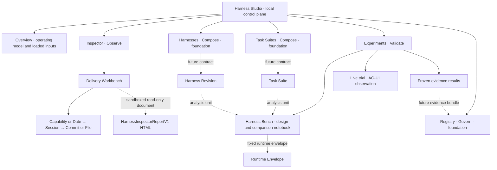

# Organize Harness Studio as a harness control plane

## Traceability

- Spec ID: harness-studio-information-architecture
- Status: Implemented

## Intent

Make Harness Studio read as a repository-native Harness Engineering control
plane instead of a collection of generic `Compare`, `Run`, and `Results`
pages. The primary information architecture should expose the durable product
objects and lifecycle described by the Studio research report:

`Observe -> Compose -> Experiment -> Explain -> Promote`.

Existing experiment, live-run, verdict, Session Debugger, and Inspector
Workbench behavior remains authoritative. Studio may organize and embed those
surfaces, but it must not merge their data models, turn observed associations
into causal claims, or present roadmap capabilities as implemented.

The supplied research report is treated as a product-direction brief, not as a
source-backed competitor benchmark. Its useful organizing unit is retained:
`Harness Revision x Task Suite x Runtime Envelope`; statistical evaluation,
promotion, collaboration, and registry maturity remain unproven roadmap scope.

## Information Architecture

The navigation order follows the operating loop `Observe -> Compose ->
Experiment -> Explain -> Promote`. `Builder`, `Run`, `Compare`, `Results`, and
`Workbench` are modes within those durable objects, not peer applications.

## Acceptance Scenarios

- AC-1: Studio has one persistent primary navigation with `Overview`,
  `Inspector`, `Harnesses`, `Task Suites`, `Experiments`, and `Registry`.
  `Builder`, `Run`, `Compare`, `Results`, and `Workbench` are presented as
  contextual actions or secondary experiment/inspection surfaces rather than
  competing top-level product concepts.
- AC-2: Overview explains the control loop and reports only capabilities
  enabled by `/api/config`. It does not invent a promoted revision, Task Suite,
  statistical result, evidence freshness, or governance state that the server
  does not provide.
- AC-3: A self-contained Harness Inspector HTML report can be supplied with an
  explicit CLI option and opened inside the `Inspector` workspace. The report
  remains read-only and authoritative behind a sandboxed document boundary;
  Studio does not duplicate its report model or rewrite its Workbench in React.
  When no report is supplied, the UI names the missing retained-evidence input.
  A live AG-UI endpoint remains under `Experiments`; it must not make the
  hard-coded Session Debugger fixture appear to be real Inspector evidence.
- AC-4: Existing experiment Builder, checkpoint lock, Run/Cancel, synchronized
  comparison selection, Trace, Evidence, live AG-UI run, and frozen verdict
  behavior remain reachable. Their current request, reducer, comparison, and
  evidence contracts are unchanged; the recorded Session Debugger sample is
  no longer a default Studio destination.
- AC-5: `Harnesses`, `Task Suites`, and `Registry` pages expose the intended
  object hierarchy and the current implementation boundary. Unsupported source
  editing, suite curation, promotion, rollback, and revalidation controls are
  not rendered as working actions.
- AC-6: At desktop width the control-plane navigation and the selected work
  surface are simultaneously legible. At 390 px the primary navigation can be
  opened and closed, all destinations remain reachable, and overflow stays
  inside dense notebook, debugger, or report regions rather than widening the
  document.
- AC-7: Navigation uses buttons, current-page state, landmark labels, visible
  focus, and text labels in addition to icons. Focused tests assert config-driven
  routing and server behavior rather than source-code strings; browser checks
  exercise Overview -> Experiments and Overview -> Inspector at desktop and
  narrow widths.
- AC-8: The optional Inspector route serves only the explicitly configured
  report file as HTML, returns a bounded 404 when absent, and does not expose a
  directory or accept a browser-provided filesystem path.

## Non-goals

- Implementing Harness source editing, semantic IR diff, Task Suite storage,
  statistical evaluation, automatic ablation, a Registry state machine, CI
  gates, promotion, rollback, or revalidation.
- Merging Inspector's cross-delivery report model with Studio's live run or
  experiment state, or moving execution controls into the read-only report.
- Claiming authorship, causality, correctness, replay, resumability, or restored
  workspace state from path, timing, trace, or checkpoint proximity.
- Adding a host adapter, authentication layer, collaboration backend, or remote
  deployment surface.
- Replacing the current light visual system, notebook comparison, Session
  Debugger, or Inspector Workbench interaction model.

## Plan and Tasks

1. Add a small application-shell model that derives destination availability,
   default next actions, and secondary surfaces from the existing config flags.
2. Recompose `App.tsx` around a responsive control-plane navigation and add
   honest Overview/foundation/Registry readiness views while mounting existing
   feature components without changing their contracts.
3. Add an optional configured Inspector report path to the server and CLI,
   expose a fixed `/inspector` route, and render it in a sandboxed iframe.
4. Extend the existing stylesheet with shell, lifecycle, readiness, iframe, and
   narrow-navigation styles while preserving component-owned dense layouts.
5. Add focused model/server tests, update CLI/package documentation, then run
   build, package tests, browser interaction checks, and desktop/narrow visual
   review.

## Test and Review Evidence

- AC-1/AC-2/AC-5/AC-7: focused application-shell model tests plus built-page
  browser interactions and DOM landmark checks.
- AC-3/AC-8: server tests for `/api/config`, `/inspector`, missing-report 404,
  and CLI parsing; browser checks confirm the iframe loads the self-contained
  Workbench and remains sandboxed.
- AC-4: existing Harness Studio model/server coverage remains green; built-app
  browser checks cover experiment locking/running, comparison selection, live
  AG-UI, Inspector drill-down, and evidence rendering.
- AC-6: browser screenshots and measured document widths at 1440 by 900 and
  390 by 844, with console/page errors inspected.
- Risk: primary navigation can imply unsupported products. Mitigation: every
  destination derives a visible availability state from current config or is
  explicitly labeled as a foundation with no active controls.
- Risk: an embedded report could be mistaken for Studio-owned mutable state.
  Mitigation: the Inspector surface says `Read-only evidence`, preserves the
  report's branding, and runs in a sandboxed document without same-origin
  privileges.
- Risk: the outer shell can reduce the space available to dense workbenches.
  Mitigation: use a compact rail on desktop, an overlay navigation on narrow
  screens, local scrolling, and direct desktop/narrow browser measurements.

### Implementation evidence

- `npm run build -w @qoder-ai/harness-studio` — passed.
- `npm run typecheck -w @qoder-ai/harness-studio` — passed.
- `npm test -w @qoder-ai/harness-studio` — 15 files / 79 tests passed.
- `npx vitest run test/skills-docs/doc-link-graph.test.mjs` — 6 tests passed;
  the routing graph was regenerated and remained unchanged.
- `npm run test:browser -w @qoder-ai/harness-studio` — 4 Chromium flows passed,
  including desktop and 390 px interaction and overflow checks.
- In-app Playwright checks at 1440 x 900 and 390 x 844 exercised Overview,
  primary navigation, Bench, the mobile Bench / Live trial switch, checkpoint
  overlay, live-run composer, real Inspector Workbench, and Inspector session
  drill-down. Measured document width matched viewport width and inspected
  browser logs contained no errors or warnings.
