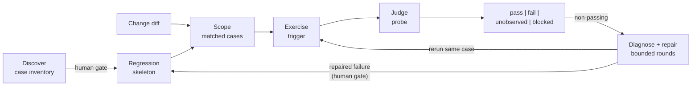

# Agent Verify Loop

Use this reference to design the verification harness that lets a coding-agent
loop check its own work on any deliverable it can change: a backend service
chain, a web UI, a mini-program screen, a mobile app, a CLI, a data pipeline,
a model-generated output, an infrastructure stack. It generalizes a recurring
field pattern — data-driven case discovery, a reusable regression skeleton,
parameterized verification probes, and diff-scoped incremental plans — into
one implementation-neutral, stack-neutral framework.

The operating rule: an agent loop is only as reliable as its machine-checkable
verification closure. If the agent cannot trigger the system, observe the
outcome, and judge the result without a human in the middle, self-repair and
autonomous delivery cannot work. This holds equally when the outcome is a
database row, a rendered page, a screenshot, an output file, or a generated
paragraph — only the evidence and the judging mode change.



## Ownership Boundary

This reference owns:

- the four planes of a verify loop and their bootstrap order;
- the probe verdict domain, the judging modes, the aggregate-verdict rules,
  and the guards on green verdicts;
- the post-verdict diagnose-repair-revalidate sequence, its round bound,
  verdict-source attribution, and flaky registration;
- the scenario-family mapping that instantiates the planes per stack;
- the regression-skeleton asset shape; and
- the human value gate that keeps machine-collected cases and baselines
  honest.

It does not own loop owner selection (`../loop-engineering/loop-discovery.md`),
the full loop runtime contract (`../loop-engineering/loop-blueprint.md`),
verification-environment construction (`verification-environment.md`), recovery
evidence (`recovery-evidence.md`), or review-trigger policy
(`review-trigger.md`).

## Load When

- A team asks how to make an agent development loop self-verifying for a
  system with multiple entrypoints, outcome surfaces, or async stages.
- Regression coverage depends on human enumeration and manual multi-target
  comparison, and the work should move to data and tools.
- Acceptance happens by eye: screenshots compared by hand, a mini-program or
  app clicked through manually, pipeline output spot-checked with ad hoc
  queries, generated text skimmed for plausibility.
- A harness review finds Change Validation evidence that only covers unit
  tests while real acceptance happens by eye.
- Verification only ever confirms what the system already does, so a promised
  behavior that was never implemented, or a repair that quietly relaxed its own
  assertion, passes unnoticed.
- The trigger and probe are understood, but the real environment is
  unavailable, unsafe, expensive, or too slow; use
  [Verification Environment Design](verification-environment.md) to select and
  calibrate the smallest credible substitute.

## The Four Planes

A verify loop separates into four planes. Each plane answers one question and
produces one durable asset. Do not collapse them into a single script pile.

| Plane | Question | Durable asset |
| --- | --- | --- |
| Discover | What must be verified? | Reviewed case inventory |
| Exercise | How is one case driven into the system? | Trigger commands / data factories |
| Judge | How is the outcome checked? | Parameterized verification probe |
| Scope | Which cases run for this change? | Diff-to-case matching rule |

The planes are stack-neutral. What varies per stack is the concrete shape of
the entrypoint, the trigger, the evidence, and the judging mode — see
[Scenario Families](#scenario-families).

### Plane 1 — Discover: coverage from data, not memory

Humans cannot enumerate entrypoints they forgot exist, and they waste effort
on dead paths. Cross four machine-readable sources, then close with a human
gate:

1. **Intent sources** (specification and acceptance criteria, prototype or
   design contract, interface contract such as an API schema or proto
   definition, issue acceptance notes): state what the system was *promised
   to do*. This is the only source available before a change ships, and the
   only one that can name behavior nobody built yet.
2. **Runtime telemetry** (metrics, QPS/TPS per endpoint, page/screen
   analytics, job schedules): lists every surface that real usage actually
   reaches, ranked by volume. High volume with no matching case is a
   coverage gap.
3. **Code contracts** (interface definitions, consumers, enums, write paths;
   route tables and page registries; component inventories; CLI command
   trees; pipeline DAG definitions): pins each entrypoint's input schema,
   outcome surfaces, and value domains. Record the lookup key or artifact
   location of every outcome surface — the probe cannot query what it cannot
   address.
4. **Real usage samples** (logs, traces, session replays, real input
   payloads): recover what genuine inputs look like, so constructed cases
   match reality instead of an imagined shape.

Each source patches the others' blind spots: intent states what should exist,
telemetry finds the surfaces that do exist, contracts define expectations on
them, samples keep inputs realistic.

Sources 2 through 4 all read the system **as built**, so a loop that uses only
them can never fail on behavior that was promised and never implemented: there
is no traffic, no route, and no sample to discover. Treat the difference
between the intent sources and the implemented contracts as coverage in its own
right — admit the case and judge it. Missing the surface to observe makes the
case `fail`, or `blocked` when the surface is externally gated; it is never a
reason to leave the case out of the inventory.

This also fixes the ceiling: verification coverage is bounded by the recorded
intent. Behavior nobody wrote down is behavior the loop will not check, so a
thin spec produces a thin verify loop no matter how good the probe is.

### Plane 2 — Exercise: every case must be machine-triggerable

A case that only a human can reproduce is not part of the verify loop. For
each case record the exact trigger: an HTTP call, an RPC invocation, a queue
message, a CLI command, a browser-automation script opening a route, a
mini-program automation command opening a page path, an emulator run, a job
submission for a fixed partition, an eval-set run — or a data-factory script
that stages the inputs first. Include environment targeting (which host,
which staging cell, which device or simulator profile) inside the trigger so
the agent never has to guess. Pin everything the outcome depends on —
fixture data, viewport, locale, timezone, clock, random seed — as part of
the trigger, not as ambient state.

When the real target cannot be used, do not default to an all-mock environment.
Use [Verification Environment Design](verification-environment.md) to state the
verification claim, discover repository-owned seams, keep claim-relevant
semantics real, and record what the substitute leaves `unobserved`.

When more than one driver class could exercise a UI, desktop, mobile, or
terminal case — an automation-protocol driver, an attach-mode browser agent,
an OS input or computer-use loop — use
[UI and System Drivers](ui-and-system-drivers.md) to pick the injection point
by claim and record what evidence that choice forfeits.

### Plane 3 — Judge: one correlation handle drives the whole check

Replace per-target manual comparison with a **parameterized probe**: a single
command that takes one **correlation handle** and walks every outcome
surface the case touches, emitting a verdict plus the evidence it inspected.

The correlation handle is the smallest input from which the probe can address
every outcome surface. Two forms cover most stacks:

- **A returned identifier** — trace id, request id, order id, run id — when
  the trigger hands one out; the probe resolves per-target lookup keys from
  it.
- **The fully-pinned trigger input itself** — route + fixture + viewport for
  a web page, page path + mock profile + device profile for a mini-program,
  command + args + fixture workdir for a CLI — when the system does not
  return an identifier. Determinism pinning in Plane 2 is what makes this
  form a valid handle: the same tuple must reproduce the same outcome.

The verdict domain is four-valued, not binary:

| Verdict | Meaning |
| --- | --- |
| `pass` | Every required assertion was checked against collected evidence and held. |
| `fail` | At least one required assertion was checked and did not hold. |
| `unobserved` | Required evidence could not be collected; nothing was proven either way. |
| `blocked` | The case could not run at all (environment, dependency, authority). |

Never map missing evidence to `pass`: "no error found" without the required
evidence is `unobserved`, and only `pass` counts as acceptance.

Judging modes — how an assertion decides — vary by outcome type, but every
mode must still emit the same four verdicts:

- **Exact assertion**: records exist, status equals, count matches, exit
  code is zero. Default for persisted state, events, and resource state.
- **Tolerance comparison**: numeric epsilon for metrics and aggregates;
  pixel-diff threshold with masked dynamic regions for screenshots. The
  tolerance and masks are part of the case, reviewed like code.
- **Baseline (golden) comparison**: diff against an approved artifact — a
  screenshot, a DOM or accessibility snapshot, a rendered-tree dump, a
  golden stdout file, an output-file checksum. A baseline update is a
  human-gated change, never an automatic reaction to a failing diff.
- **Property or rubric evaluation**: for non-deterministic output (model
  generations, ranked lists), assert properties that must always hold
  (schema, safety flags, invariants) and score the rest against a rubric
  with a pre-agreed threshold; at or above threshold is `pass`, below is
  `fail`, evaluator unavailable is `unobserved`.

Design constraints:

- Input is one correlation handle; the probe resolves lookup keys and
  artifact locations per surface itself.
- Output is layered for its three readers: a machine-parseable verdict first
  for the loop, the localized diagnostic detail second for whoever repairs it,
  and a short human-readable summary last for whoever accepts the result.
  Collapsing the layers forces every reader to parse the other two.
- Collected evidence is addressed per run and append-only within a run: a
  later capture never overwrites an earlier one in the same run, or the
  before/after chain the repair step depends on is destroyed.
- The probe checks the environment outcome, never the system's or the agent's
  own success claim.
- Failure output localizes the break: which stage, which surface, expected
  versus observed — and for comparison modes, the diff artifact itself.
- Asynchronous or settling chains need explicit bounds: a terminal condition
  per surface (what state means "settled" — a consumed message, a
  render-idle page, a booted simulator, a job in terminal state), a
  deadline, and a polling/backoff policy. Evidence that has not arrived
  inside the deadline is retried per policy; at the deadline it becomes
  `unobserved`, not `fail` — eventual consistency must not turn into flaky
  pass/fail behavior.
- Flaky comparison verdicts are a pinning bug, not a threshold bug: fix the
  unpinned nondeterminism source (clock, animation, data order, font,
  locale) instead of widening the tolerance until the diff goes green.
- Keep the default evidence cheap (test results, state queries, log lookups,
  snapshot diffs); escalate to expensive collection (tracing, video capture,
  capture/replay) only after a `fail` or `unobserved`, and record the
  escalation with the evidence.

The probe is the highest-leverage asset in the loop: it converts "how do I
know it worked?" from tribal knowledge into a callable function.

### Plane 4 — Scope: incremental plans from diffs

Full regression on every change is slow and teaches the agent to skip
verification. Instead:

```text
change diff -> touched surfaces (interfaces, consumers, pages, components,
               DAG nodes, outcome surfaces)
           -> matched cases from the skeleton
           -> focused plan -> execute -> backfill results
```

The matching rule maps changed files or symbols to the entrypoints and
outcome surfaces each case covers — API handlers to chain cases, components
to the pages that render them, DAG nodes to the partitions they produce.
When matching confidence is low, widen to the owning priority tier rather
than silently running nothing.

The plan's aggregate verdict follows the weakest matched case, so skipping
never manufactures a green run:

- `pass` requires every matched case to be `pass`;
- any matched `fail` makes the run `fail`;
- a matched high-priority case that is `blocked` or `unobserved` makes the
  run `blocked` — it is non-passing acceptance evidence, not a footnote;
- lower-priority `blocked` or `unobserved` cases demote the run to `partial`
  with each gap named (case id, reason, missing evidence).

Environment evidence caps each case verdict. A case exercised below the
fidelity rung its claim requires, or on an environment whose own gates did not
pass, is at best `unobserved` — a lower rung going green is not case
acceptance. Report the highest completed rung alongside the result; see
[Verification Environment Design](verification-environment.md) for the rung and
gate definitions.

A `partial` or `blocked` run can still inform delivery, but only a human can
accept it — the loop itself must not treat it as `pass`.

## Guard the Green Verdict

A green verdict is a claim about what ran, not merely that nothing errored. The
aggregate rules above stop a skipped case from manufacturing a `pass`; the same
standard applies to how the run collected its cases. Three guards:

- **An empty run fails.** A run that executed zero of its matched cases is not
  `pass`, whatever its exit code. This is the zero-test case covered in
  [Verification Environment Design](verification-environment.md): the runner
  must refuse to report green when nothing was judged.
- **Fail fast over silent fallback.** When a required input, fixture, or remote
  fetch fails, the run must fail loudly at that point, not silently substitute a
  narrower path and still report green. A fallback changes what is exercised, so
  it changes the claim — the run must say so by not passing.
- **No silent exits.** A harness script that stops early — under `set -e`, a
  missing tool, a skipped stage — without reporting that it did not run is a
  fake green. Every early exit must surface as a non-passing verdict, never a
  zero exit code.

## After a Non-Passing Verdict

A verdict is where the loop turns, not where it ends. Without a stated
continuation an agent improvises, and the cheapest improvisation is to make the
judge more permissive. Attribute the verdict source first, then run the repair
sequence only for failures the change owns.

**Attribute the verdict before touching code.** The repair sequence below
assumes the failing check is locally runnable and reproducible; hosted CI usually
is not. Its runner, network, caches, and consumed repositories are shared state
the loop does not control. Classify where a red verdict comes from before
spending a repair round, using the cheapest evidence first:

| Source | Distinguishing evidence | Continuation |
| --- | --- | --- |
| Local change | the failing assertion touches a file or behavior the diff changes; the case reproduces on the same correlation handle | run the repair sequence below |
| Infrastructure | the same failure also hits the base revision, unrelated branches, or other PRs; it is independent of the diff's content | rerun once, then escalate to the CI owner — do not edit the change |
| Upstream asset drift | the consumed repository, fixture, or test corpus changed or deleted a case after the last green run; the failing surface is not touched by the diff | repin or resync the asset — do not edit the change to appease the failure |

Only a local-change attribution enters the sequence below and consumes the round
budget. Editing the diff against an infrastructure or upstream failure burns
rounds on a cause the change does not own, and leaves the real cause live under
a temporarily passing verdict.

When the failing check cannot be reproduced locally, substitute cross-signal
evidence for reproduction: does the base revision fail the same way, do unrelated
branches fail the same way, did the failure start before the diff touched the
failing surface? When none of these signals is available, the verdict is
`blocked` pending CI evidence, not a presumed local defect.

For a local-change verdict, run this sequence:

```text
reproduce -> localize -> attribute to smallest owner -> repair
  -> rerun the same case -> record the round
```

1. **Reproduce** on the same correlation handle before diagnosing anything. A
   verdict that does not reproduce is a flakiness finding, not a defect
   finding, and goes to the flaky path below.
2. **Localize** with the cheapest sufficient diagnostics, escalating to
   expensive collection only when the cheap layer does not localize the break.
   What the trigger's driver emits bounds this step — see
   [UI and System Drivers](ui-and-system-drivers.md) for choosing a driver by
   the failure evidence it produces.
3. **Attribute** to the smallest correct owner. A repair applied one layer
   above the cause leaves the cause live under a passing verdict.
4. **Repair**, then **rerun the same case**: same case id, same assertions,
   same judging mode, same tolerance and masks. A rerun with a relaxed
   assertion or a substituted case proves nothing about the original failure.
5. **Record the round.**

Each round records the round number, the root-cause hypothesis it tested, the
change scope it applied, and the rerun verdict. Every round must advance a
*different* hypothesis; re-testing the same hypothesis with a slightly
different edit is not a round of progress and should not consume the budget as
if it were.

Agree the round bound before the loop runs. At the bound, the case becomes
`blocked` and goes to a human with the round record attached — the bound exists
precisely because an agent cannot tell "one more attempt" from "wrong model of
the problem".

**Sweep the same cause.** A repaired root cause is a pattern, not an incident.
Search the other cases and surfaces that share it — the same unpinned clock,
the same missing null branch, the same unhandled status — and route the matches
into the skeleton through the human gate. This is where a repair pays for
itself beyond the one case that failed.

**Register flakiness rather than absorbing it.** When the same case on the same
revision yields different verdicts across runs, mark it `flaky` in the skeleton
and record the suspected nondeterminism source. A `flaky` case contributes to
the aggregate verdict as `unobserved` until the source is pinned: it must not
supply a `pass` by being run again, and it must not turn a run red at random.
Flakiness is a pinning defect with an owner and a fix, not a property of the
case.

## Scenario Families

The rows below instantiate the four planes for common stacks. They are
examples, not a closed list: a new family joins the framework by answering
the same four questions — what to verify, how to trigger, what handle the
probe takes, and how the outcome is judged.

| Family | Trigger | Correlation handle | Evidence probed | Default judging mode |
| --- | --- | --- | --- | --- |
| Service / API chain | HTTP/RPC call, queue message | trace / request / order id | rows, streams, logs per target | exact assertion |
| Web UI | browser automation opening a route with fixture | route + fixture + viewport | DOM/a11y snapshot, screenshot, console errors, network calls | baseline diff with masks + exact assertions |
| Mini-program / super-app plugin | automation driver opening a page path with a mock profile | page path + mock profile + device profile | page data/state, rendered-tree snapshot, screenshot, reported API calls | baseline diff + exact state assertions |
| Mobile app | emulator or device automation | screen route + fixture + device profile | UI tree, screenshot, local store, emitted analytics | baseline diff + exact assertions |
| CLI / desktop tool | command with pinned args, env, workdir | command + args + fixture workdir | exit code, stdout/stderr, produced or modified files | golden comparison + exact assertions |
| Data pipeline / batch | job submission for a fixed partition | run id + partition | output tables/files: row counts, checksums, schema, quality metrics | exact + tolerance comparison |
| Model / LLM output | eval-set run with pinned prompt and params | eval run id + case id | generated output, scores, safety flags | property + rubric with thresholds |
| Infrastructure as code | plan/apply against a sandbox stack | stack + change-set id | plan diff, post-apply resource state queries | exact assertion on state |

Constraints differ per family and belong in the case record: mini-program
and mobile families are often `blocked` by devtools, signing, account, or
store-review boundaries; model-output families need the evaluator itself
version-pinned; UI families need their determinism pinning (Plane 2) before
baseline judging is trustworthy.

When one system spans several families — an admin web console, a mobile app, a
mini-program, and a degraded web view of the same flow — each family arrives
with its own per-platform tooling and its own native result format. The Plane 4
aggregate rules cannot run across them until every case normalizes to the same
four-valued verdict domain and the same result schema, whatever tool produced
it. Normalize at the boundary: wrap each platform's driver behind a
task-oriented command that emits the shared schema, so the agent works against
verification evidence rather than against one tool's API. See
[Agent-Friendly CLI](friendly-cli.md) for contract, surface, and projection
design; per-platform result formats that never converge are why multi-platform
verification stays unaggregatable.

## Where To Start

Bootstrap in this order; each step yields a usable asset even if work stops
there:

1. **One tracer-bullet case, end to end.** Pick the highest-volume path — the
   busiest API chain, the most-visited page or screen, the most-run job.
   Write its trigger and verify it by hand once, recording every query,
   snapshot, and comparison used. This exposes the correlation handle, the
   per-surface lookup keys or artifact locations, and (for comparison-judged
   families) the first human-approved baseline.
2. **Extract the probe.** Turn the manual checks from step 1 into the
   parameterized probe. Validate it against test data or sanitized fixtures
   before generating anything new. Existing staging or production data is
   never a default input: reading it requires explicit authorization, a
   read-only scope, redaction of sensitive fields in probe output, and an
   agreed environment boundary — record all four in the case `constraints`.
   If that environment does not yet exist, construct its minimum credible rung
   with [Verification Environment Design](verification-environment.md),
   including readiness, reset, cleanup, an independent oracle, and a known-bad
   control.
3. **Backfill discovery.** Run the four-source discovery to inventory all
   entrypoints and promised behavior; diff against the (currently one-case)
   skeleton to rank gaps.
4. **Grow the skeleton by priority tier.** Add cases highest-volume-first,
   each passing the human gate below.
5. **Wire the diff matcher last.** Incremental scoping only pays off once the
   skeleton has enough cases for "run everything" to hurt.

Starting with the probe instead of case enumeration is deliberate: the probe
makes every subsequent case cheap to validate, while a case list without a
probe is still manual work.

## Regression Skeleton Asset Shape

Keep cases as declarative records (YAML/JSON), not prose. Minimum fields:

```yaml
id: <stable case id>
entrypoint: <surface + method/topic/path/route/page/command>
scenario: <business meaning, one line>
priority: <tier, e.g. P0 write-chain .. P3 read-only>
status: live | low-traffic | stock-data-only | flaky | blocked | draft
trigger: <exact command or script + parameters, with pinned fixtures>
expects:
  - target: <table/stream/state store/rendered artifact/output file>
    key: <lookup key field or artifact location>
    assert: <records, status, value domain, or baseline + tolerance/masks>
probe: <probe command with correlation-handle placeholder>
constraints: <external dependencies that limit executability, or none>
```

`status` is required: it records why a case can or cannot run unattended, so
the agent skips blocked cases with a reason instead of failing noisily. A
skip is never silent — every skipped matched case surfaces in the aggregate
verdict under the Plane 4 rules, so blocked coverage stays visible instead
of turning into a green run.

Baseline artifacts (screenshots, snapshots, golden files) are versioned
assets stored next to their cases; every baseline creation or update passes
the human gate below, with the diff that motivated the update attached.

## Human Value Gate

Machines assemble the candidate list; a human admits cases into the skeleton.
Review four things per candidate:

- **Authenticity**: real business traffic, not health checks, crawlers, or
  internal noise.
- **Deduplication**: no existing case already covers the same
  entrypoint-times-scenario combination.
- **Verifiability**: the expected outcome is decidable (which surface, what
  state or artifact, judged how); mark externally constrained cases in
  `constraints` rather than admitting undecidable ones.
- **Priority**: tier by blast radius, typically write chains before
  read-only paths before monitoring fallbacks.

For comparison-judged families the same gate also approves the initial
baseline and every baseline update: a human confirms the new artifact is the
intended outcome, not a regression being memorized as correct.

The gate is the division of labor, not a bottleneck: machines spread the
range, humans close the value.

## Rollout

Adopt the same staged sequence as
[Loop Blueprint](../loop-engineering/loop-blueprint.md): run the probe
manually first, then report-only in the change pipeline, then gate merges on
matched-case results. Do not let the agent treat probe output as advisory
once it gates anything — a verdict the loop can ignore trains the loop to
ignore it.

Close the loop on failures: run the
[post-verdict sequence](#after-a-non-passing-verdict), then promote every
diagnosed-and-repaired failure into a candidate case — its trigger, correlation
handle, and the assertion that caught it are already known — through the same
human gate as discovered cases. Discovery grows coverage in breadth; repaired
failures grow it exactly where the system actually broke.

## Anti-Patterns

- **Case list without a probe**: coverage that still requires human judging
  is documentation, not a verify loop.
- **Coverage from the system only**: deriving cases from telemetry, code, and
  samples alone, so behavior that was promised and never implemented has no
  case and can never fail.
- **Probe keyed on internal state**: if the input is not a handle the
  trigger already returns or fully determines, the agent cannot chain
  trigger → probe.
- **Skeleton as a one-off audit**: without the diff matcher and result
  backfill, the skeleton decays into a stale spreadsheet.
- **Machine-only admission**: skipping the human gate fills the skeleton with
  noise cases whose failures nobody trusts.
- **Self-reported success**: accepting the system's response code or the
  agent's summary instead of probing the environment outcome.
- **Green by omission**: reporting `pass` when required evidence was never
  collected or matched cases were skipped; missing evidence is `unobserved`
  and skipped coverage demotes the aggregate verdict.
- **Silent fallback green**: a required fetch, fixture, or setup fails and the
  run quietly substitutes a narrower path while still reporting `pass`, hiding
  that the intended cases never executed.
- **Auto-approved baselines**: regenerating goldens or screenshots whenever
  the diff fails turns the judge into a mirror — it memorizes regressions as
  the new correct.
- **Threshold creep**: widening visual or numeric tolerance to silence flaky
  comparisons instead of pinning the nondeterminism source.
- **Repair until green**: each repair round relaxing an assertion, swapping in
  an easier case, or widening a tolerance instead of testing a new root-cause
  hypothesis against the original case.
- **Repairing the diff for the environment**: spending repair rounds editing the
  local change to appease a failure whose source is infrastructure or upstream
  asset drift, burning the round budget on a cause the diff does not own.
- **Unbounded repair rounds**: retrying diagnosis and repair with no agreed
  round bound and no round record, so a wrong model of the problem burns the
  budget instead of escalating to a human.
- **Flakiness absorbed as a pass**: rerunning an oscillating case until it goes
  green and reporting that run, instead of registering the case `flaky` and
  fixing the pinning defect.
- **Unbounded waiting on async chains**: a probe with no terminal condition,
  deadline, or backoff policy either hangs the loop or converts eventual
  consistency into flaky failures.
- **Mock-selected-before-claim**: choosing a convenient double before naming
  the behavior to prove hides whether the omitted dependency semantics are the
  very subject of verification.
