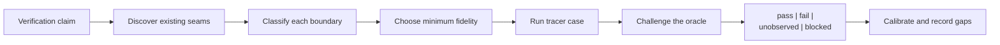

# Verification Environment Design

Use this reference when an agent can change code but cannot safely or cheaply
exercise the real environment. The goal is not to maximize mocking. The goal
is to construct the **smallest environment that preserves the behavior needed
by the verification claim**, then state exactly what that environment does not
prove.

A fast fake can be the right environment for request shaping and the wrong
environment for database isolation, browser behavior, compiler output,
concurrency, or vendor compatibility. Select the substitute only after naming
the claim and the dependency semantics that decide it.



## Ownership Boundary

This reference owns:

- discovery of repository-owned test-environment seams;
- claim-driven selection among fakes, virtual services, emulators, ephemeral
  real dependencies, and authorized sandbox checks;
- the environment contract and lifecycle shape;
- oracle independence, negative controls, and mock-drift calibration; and
- environment safety, isolation, cleanup, and portability.

It does not own case discovery, the regression skeleton, probe verdicts, or
diff-to-case scoping; use [Agent Verify Loop](agent-verify-loop.md). It also
does not own general diagnostic instrumentation
([Observability](observability.md)), recovery evidence
([Recovery Evidence](recovery-evidence.md)), or production authorization.

## Load When

- A required service, device, account, dataset, kernel feature, or vendor
  sandbox is unavailable to the agent.
- A test suite passes with extensive mocks, but it is unclear which real
  behaviors remain proven.
- Local verification requires manual environment setup, shared credentials,
  fixed ports, or persistent state.
- A container or emulator exists, but nobody has checked whether it preserves
  the semantics relevant to the change.
- The agent must add a reproducible environment before it can close an
  Agent Verify Loop exercise-and-judge path.

## Start With the Claim

Write the claim before selecting a tool:

```text
Given <pinned starting state>, when <real subject action> runs,
observe <evidence> at <boundary>, and decide <expected invariant>,
under <platform / time / authority constraints>.
```

This turns “we need a mock database” into a decidable question:

- If the claim is “the repository calls `save()` with these fields,” an
  in-process spy may be enough.
- If the claim is “the migration, constraint, transaction, or query works on
  PostgreSQL,” PostgreSQL semantics are part of the claim; use an ephemeral
  real instance or an explicitly compatible emulator.
- If the claim is “checkout succeeds against the payment provider,” a local
  stub can prove request construction and failure handling, but provider
  acceptance remains `unobserved` until an authorized sandbox or contract
  verification runs.

Keep the code under change real. Replace a collaborator only at an explicit
boundary, and only when its omitted behavior is not part of the claim.

## Discover Before Constructing

Do not begin by adding a new mock framework or Dockerfile. Inventory the
repository in this order:

1. **Operating instructions and CI:** `AGENTS.md`, contribution guides,
   workflow files, build scripts, package scripts, Make targets, and test
   matrices. Extract the commands the project already treats as executable.
2. **Pinned environment inputs:** lockfiles, runtime/version files, container
   tags or digests, generated schemas, compiler flags, browser/device matrices,
   environment-variable schemas, locale/timezone/seed settings.
3. **Existing seams:** fixtures, fake factories, `__mocks__`, test builders,
   in-memory transports, local servers, service virtualizers, emulators,
   Testcontainers, Compose services, recorded snapshots, contract tests, and
   sandbox profiles.
4. **Lifecycle evidence:** setup, start, readiness, reset, teardown, timeout,
   and skip behavior. A service definition without readiness and reset is not
   yet an agent-ready environment.
5. **Real-only boundaries:** credentials, paid or rate-limited APIs, signing,
   hardware, OS/kernel capabilities, proprietary data, and production-only
   topology.

Prefer executable configuration over prose when they conflict, and record the
conflict instead of silently choosing one. Reuse the repository's narrowest
working seam before inventing a parallel test architecture.

The discovery output is a boundary inventory:

| Boundary | Behavior needed by claim | Existing seam | Candidate mode | Evidence gap |
| --- | --- | --- | --- | --- |
| subject | changed behavior | production module | real | none |
| database | transactions + constraints | container fixture | ephemeral real | production topology |
| provider API | request/response contract | fake HTTP server | virtualized | live provider behavior |
| browser | DOM + origin behavior | browser fixture | real local browser | device/vendor integration |

## Choose Fidelity by Behavior

Use the lowest rung that preserves the behavior under judgment, not the lowest
rung that makes the test green.

| Verification claim | Minimum credible environment | What it does not prove |
| --- | --- | --- |
| Pure transformation, validation, state machine | Real module + pinned inputs; no double unless needed to supply input | I/O integration |
| Calls, emitted events, retry selection | Fake/spy at the narrow collaborator boundary; keep orchestration real | Collaborator semantics |
| HTTP/RPC/message encoding and error handling | Local protocol server or virtual service with real serialization and request matching | Provider implementation |
| Consumer/provider compatibility | Consumer contract test plus provider verification; provider state explicit | End-to-end workflow |
| Database, broker, cache, filesystem semantics | Ephemeral real implementation or a compatibility-qualified emulator | Production scale/topology |
| Browser rendering, storage, origin, accessibility | Isolated real browser with local fixtures; virtualize only external network edges | Third-party/device integration |
| Core-path completion under degraded runtime capability | A pinned floor profile of the target runtime: constrained network, older engine version, missing platform API, failing native bridge | Behavior at full capability; pixel or layout fidelity |
| Compiler, debugger, OS, driver, native runtime | Real toolchain and target backend for the affected platform; use synthetic inputs only below that boundary | Other platform variants |
| Multi-service workflow | Real changed services plus contract-verified peers and real semantic state stores | Full production topology |
| Performance, races, resilience, security, vendor acceptance | Authorized sandbox/staging or controlled real boundary | Production behavior unless explicitly sampled |

Use these decision rules:

1. If the real collaborator is cheap, deterministic, and safe in-process, keep
   it real.
2. If the claim depends on a collaborator's protocol only, virtualize the
   service but keep real serialization, parsing, and transport behavior.
3. If the claim depends on engine semantics, run the real engine ephemerally.
4. If an emulator has known compatibility limits, name them in the contract and
   add a calibration rung against the real boundary.
5. If no stable contract or authorized observation exists, do not invent the
   collaborator's behavior. Mark the required evidence `unobserved` or the run
   `blocked`.

“Real” is boundary-relative. A containerized PostgreSQL process is real for SQL
and transaction semantics, but not for a managed service's topology, extensions,
latency, failover, or IAM. A real local browser is real for DOM and origin
behavior, but not for a payment provider's iframe or device wallet.

Capability degradation is a separate dimension from dependency fidelity: it asks
how poor the *target runtime* may be, not how real the dependencies are. A floor
profile is judged on whether the core path still completes — the flow reaches its
terminal state and the persisted outcome is correct — and explicitly not on
pixel or layout equality with the full-capability environment. Pin the floor
(which engine version, which bandwidth and latency, which API absent, which
bridge failing) in the environment contract, or the case silently re-tests the
full-capability path.

For browser and UI claims, how the browser is *driven* is a separate choice
from how real it is: an attached real-profile browser or an OS-driven user
session has higher session realism but **lower isolation** than the L3
isolated real browser, and that inversion is recorded in the case
`constraints`, not read as a higher rung. Use
[UI and System Drivers](ui-and-system-drivers.md) to choose the injection
point and its observation adapter.

## Fidelity Ladder

Build a ladder rather than one oversized environment. A change climbs only as
high as its claim requires.

| Rung | Environment | Typical evidence |
| --- | --- | --- |
| L0 — preflight | Pinned toolchain, dependency/lock validation, configuration schema | versions, install/build readiness, manifest checks |
| L1 — hermetic component | Real subject, in-process inputs/doubles, no network | unit/property results, exact state/assertions |
| L2 — boundary simulation | Local protocol server, fake transport, contract fixture, recorded response | requests observed, protocol/error cases, contract artifact |
| L3 — semantic dependency | Ephemeral real database/broker/browser/toolchain or qualified emulator | migration/query/render/runtime behavior |
| L4 — sandbox system | Multiple real processes with virtualized external edges | workflow outcome and correlated evidence |
| L5 — real-boundary calibration | Authorized provider sandbox, device/platform matrix, staging sample | differential/contract result and remaining gaps |

Every rung needs:

- a bounded setup/start command;
- a readiness probe that checks behavior rather than process existence;
- unique or isolated state per run;
- a deterministic reset and cleanup path, including failure cleanup;
- a verification command with a machine-readable verdict;
- a timeout and resource limit; and
- an explicit list of higher-rung claims it cannot prove.

Do not run every rung by default. Map the change to the lowest sufficient rung,
then escalate after a `fail`, `unobserved`, fidelity-sensitive diff, or scheduled
calibration. Report the highest completed rung and every skipped required rung.

## Bootstrap One Tracer Environment

1. Select one Agent Verify Loop tracer case and write its claim.
2. Build the boundary inventory from repository evidence.
3. Classify each dependency as `real`, `ephemeral-real`, `emulator`,
   `virtual-service`, `fake`, or `unavailable`; explain why.
4. Pin the toolchain, inputs, clock/seed, service versions, and platform.
5. Implement setup → readiness → reset → exercise → judge → teardown for the
   minimum credible rung.
6. Run a known-good control. It must pass with the required evidence present.
7. Run a known-bad control that breaks the behavior named in the claim. The
   harness must fail for the expected reason.
8. Calibrate the substituted boundary against a contract, real dependency, or
   authorized sandbox observation.
9. Only then generalize the environment for more cases or platforms.

The known-bad control is essential for AI-authored tests: it proves the harness
is sensitive to the target behavior rather than merely executable.

## Environment Contract

Store a declarative contract next to the cases or harness configuration. Keep
commands portable; the YAML below is a shape, not a prescribed filename.

```yaml
id: <stable environment id>
claim: <behavior this environment can prove>
source:
  revision: <repository commit or content hash>
  platforms: [windows, macos, linux] # actual supported subset
toolchain:
  runtime: <name + pinned version>
  dependencies: <lockfile or image digest>
subject:
  component: <real code under test>
  entrypoint: <command/module/route>
boundaries:
  - name: <dependency>
    mode: real | ephemeral-real | emulator | virtual-service | fake | unavailable
    contract: <schema/spec/provider test/observed invariant>
    version: <pinned version or digest>
    reason: <why this mode is sufficient for the claim>
    fidelity_gaps: [<behavior not preserved>]
lifecycle:
  setup: <bounded command>
  ready: <behavioral probe>
  reset: <clean-state command>
  stop: <cleanup command>
isolation:
  filesystem: <unique portable temp root>
  network: <disabled/allowlisted; dynamic ports preferred>
  state: <per-run namespace/database/profile>
  determinism: <clock, seed, locale, timezone, ordering>
oracle:
  source: <existing contract/reviewed baseline/provider invariant>
  command: <machine-readable judge>
  known_good: <control case>
  known_bad: <negative control and expected failure>
calibration:
  against: <real dependency/provider/sandbox or unavailable>
  command: <contract/differential check>
  last_observed: <timestamp + revision>
  expires_after: <policy>
constraints: [<authority, credentials, platform, resource limits>]
```

Do not store secret values or unsanitized production payloads in this asset.
Record only secret names, providers, and required authority.

## Make the Oracle Independent

An environment is not verified because the test process exited zero. The
oracle must come from evidence not invented from the changed implementation.
Prefer, in order:

1. a pre-existing acceptance test, public schema, language/runtime contract,
   or externally owned specification;
2. a consumer contract replayed against the real provider implementation;
3. a reviewed golden, fixture, trace, or snapshot with provenance;
4. an independently observed invariant from an authorized environment; or
5. a human-reviewed expected result for the initial tracer case.

Then prove sensitivity in both directions:

- **known good → pass** with all required evidence collected;
- **known bad → fail** at the expected assertion; and
- unavailable evidence → `unobserved`, never `pass`.

Also inspect the test count, selected cases, skips, retries, and flaky results.
`0 tests`, “all relevant tests skipped,” or a runner configured to pass with no
tests is not positive evidence. A newly generated baseline must not be approved
by the same automated step that changed the implementation.

## Control Drift

Every substitute drifts unless it is checked:

- Version fakes and recorded responses with source, capture time, schema or
  provider revision, sanitizer version, and expiry policy.
- Prefer contract fixtures with minimal required fields over copied full
  payloads, but keep unknown-field and error cases where compatibility depends
  on them.
- Replay consumer contracts against the provider, or run a differential probe
  that sends the same sanitized cases to the substitute and authorized real
  boundary.
- Exercise failures that are hard to summon from the real service: timeout,
  reset, malformed response, partial result, retryable and terminal errors.
- Reset stateful virtual services between cases; hidden scenario state makes
  order-dependent tests.
- When calibration expires or cannot run, preserve the last observation and
  demote the affected claim to `unobserved` or `partial`.

Record/replay is a bootstrap technique, not a permanent truth source. Redact
before committing, parameterize volatile identifiers, and retain the contract
that explains which parts of the recording matter.

## Safety and Portability

- Default to no production credentials, no unsanitized production data, and no
  unrestricted network. Use obviously fake test values or authorized,
  minimized fixtures.
- Isolate agent-generated code in an ephemeral workspace, container, VM, or
  equivalent boundary appropriate to its risk. Do not treat a container as a
  complete security boundary.
- Prefer dynamically allocated ports and platform temp-directory APIs over
  fixed ports and `/tmp` literals.
- Pin runtime and dependency versions. For container images, pin a meaningful
  version and use a digest where reproducibility or supply-chain integrity
  requires it; avoid `latest`.
- Make cleanup idempotent and run it after success, failure, and timeout. Give
  each parallel worker a unique state namespace.
- Keep Windows, macOS, and Linux command/path differences in the lifecycle
  contract. A container-only path is one supported rung, not universal support.
- Bound CPU, memory, disk, worker count, retries, and wall time. Resource
  exhaustion is `blocked`, not a product failure.

## Cross-Stack Patterns Observed

The following patterns came from read-only Qoder CLI studies on 2026-08-04.
No tests or services were run, so these are repository observations and design
inputs, not runtime validation.

| Repository shape | Observed environment strategy | Transferable lesson | Visible gap |
| --- | --- | --- | --- |
| Browser payment SDK (`braintree-web`) | Jest/jsdom, a central fake client/config factory, auto-mocked cross-frame transport, fake XHR, then build/export tests and real-browser stories | Replace the external transport, keep request construction, packaging transforms, DOM, and artifact contracts real | Unit fakes cannot prove cross-origin messaging, gateway, wallet, or sandbox behavior; bare Jest can make version assertions vacuous |
| Go debugger (`delve`) | Synthetic DWARF + fake memory for pure evaluation, in-memory network transport, recorded/core replay, then fixtures compiled by the real Go toolchain and real OS backends | Move the seam inward for fast tests, but keep compiler output and OS/kernel semantics real when they are the subject | Environment gates mostly skip; a green run without skip accounting overstates platform coverage |
| Spring microservices transaction sample | Real ephemeral PostgreSQL/RabbitMQ through Testcontainers, discovery disabled, and an in-process event bus supplying coordinator state | Mix substitutes by semantics; database/broker behavior can stay real while irrelevant topology is removed | Container/Compose versions drift, order-service lacks equivalent coverage, and unbounded waits can turn failures into hangs |
| TypeScript ecommerce monorepo (`nimara-ecommerce`) | Module-boundary HTTP/provider fakes with native requests, committed fake env values, real Postgres only for ledger work, LocalStack only for secrets work, deployed URL for E2E | Start with handler-level seams and add semantic services only for changed boundaries | `passWithNoTests` and unavailable E2E/codegen dependencies can create false-green or incomplete evidence |

Evidence anchors inspected by the read-only studies:

- `braintree-web`: `test/helpers/index.js`, `__mocks__/framebus.js`,
  `test/publishing/setup.js`, and
  `.storybook/tests/helpers/test-server.ts`.
- `delve`: `pkg/proc/dwarf_expr_test.go`, `service/listenerpipe.go`,
  `pkg/proc/test/support.go`, and `Documentation/backend_test_health.md`.
- Spring sample:
  `account-service/src/test/kotlin/pl/piomin/samples/account/AccountControllerTests.kt`,
  `account-service/src/main/kotlin/pl/piomin/samples/account/service/EventBus.kt`,
  `transaction-server/src/test/kotlin/pl/piomin/samples/transaction/TransactionBrokerConfiguration.kt`,
  and `docker-compose.yml`.
- `nimara-ecommerce`: `apps/marketplace/docker-compose.yml`,
  `apps/marketplace/src/app/api/stripe/connect/webhook/route.test.ts`,
  `apps/automated-tests/playwright.config.ts`, and
  `apps/storefront/vitest.config.ts`.

Across all four shapes, the durable pattern is:

```text
real changed subject
+ smallest contract-shaped substitutes
+ real semantics for the boundaries named in the claim
+ one higher-fidelity calibration path
+ explicit gaps and skip accounting
```

## Anti-Patterns

- **Mock everything:** the test proves the agent's assumptions about its own
  fakes, not the changed system.
- **Container first, claim later:** a large Compose stack is expensive but may
  still omit the behavior under judgment.
- **AI-written oracle as sole evidence:** implementation and expected result can
  share the same mistake.
- **Pass without sensitivity:** no known-bad control proves the harness could
  catch the regression.
- **Green through zero or skipped tests:** process success is mistaken for case
  coverage.
- **Ambient environment:** local credentials, shared state, wall clock, fixed
  port, locale, or PATH silently decides the result.
- **Fake semantic engines:** an in-memory map is treated as proof of database,
  broker, filesystem, or concurrency behavior.
- **Stale recordings:** captured traffic has no provenance, redaction,
  contract, expiry, or provider replay.
- **Emulator equals production:** known compatibility gaps disappear from the
  verdict.
- **Unavailable boundary hidden:** a lower rung passes and the required higher
  rung is omitted from the report.

## Research Basis

- [SWE-bench](https://www.swebench.com/original.html) constructs a pinned
  execution environment per task and uses fail-to-pass behavior as the primary
  evaluation signal; its
  [Multilingual validation procedure](https://www.swebench.com/multilingual.html)
  explicitly checks that tests fail before the gold change and pass after it.
- [SWE-agent](https://papers.neurips.cc/paper_files/paper/2024/file/5a7c947568c1b1328ccc5230172e1e7c-Paper-Conference.pdf)
  uses ephemeral isolated execution and emphasizes concise command-effect
  feedback to the agent.
- [Testcontainers](https://java.testcontainers.org/) documents throwaway real
  databases, brokers, browsers, and application dependencies starting from
  known state.
- [Pact provider verification](https://docs.pact.io/getting_started/how_pact_works)
  pairs a consumer-side mock interaction with replay against the real provider,
  preventing the mock from becoming the only contract authority.
- [WireMock service virtualization](https://wiremock.org/docs/solutions/service-virtualization/)
  demonstrates controlled state, record/replay, latency, and fault injection at
  an HTTP boundary.
- [Playwright isolation](https://playwright.dev/docs/browser-contexts) uses a
  clean browser context per test to prevent state leakage and cascading
  failures.
- [Docker build guidance](https://docs.docker.com/build/building/best-practices/)
  recommends pinning base-image versions and digests when supply-chain and
  reproducibility guarantees require it.
