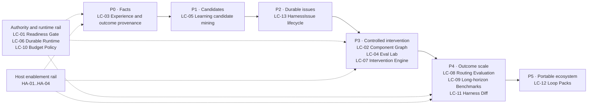

# Better Harness Evolution Roadmap

References: [Architecture](docs/ARCHITECTURE.md) ·
[Agent Work Loop](models/agent-work-loop.md) ·
[Loop Engineering](references/loop-engineering/README.md) ·
[Host Adapter Matrix](docs/adapters/README.md) ·
[Discussion #76](https://github.com/QoderAI/better-harness/discussions/76)

## Product Position

Better Harness is the evidence and control plane for improving Coding Agent
workflows. It is not another Coding Agent runtime.

| Better Harness owns | The host Coding Agent owns |
| --- | --- |
| Harness component identity, revision, activation, and rollback provenance | Model execution and native tool calls |
| Provider-neutral evidence, Task Episodes, experience traces, and outcome-link contracts | Provider permissions, user interaction, subagents, worktrees, and hooks |
| Candidate review, durable Harness Issues, eval suites, comparisons, guardrails, and intervention decisions | Provider-specific execution of an explicitly approved bounded plan |
| Durable loop state, approval, budget, stop, resume, and audit contracts | Native installation, authentication, and runtime lifecycle |

The product should evolve through one thin, auditable evidence chain:

```text
TaskEpisode + delivery/outcome links
    -> PatternCandidate
    -> human/AI review
    -> HarnessIssue
    -> bounded Harness intervention
    -> held-out and later comparable outcome
    -> retain / narrow / revise / revert / reopen
```

This ordering is deliberate. Better Harness must establish facts before mining
patterns, review patterns before making them durable, and prove a bounded
intervention before adding autonomous or scheduled runtime behavior.

## Domain Boundaries

| Concept | Lifetime | Meaning |
| --- | --- | --- |
| `TaskEpisode` | One task goal | What happened for one goal, target, action, and result. |
| `PatternCandidate` | One discovery window | A reviewed hypothesis supported by multiple Episodes; it is not yet a durable problem or a Skill. |
| `Finding` | One Harness report | A report-local, evidence-backed consequence; it does not own longitudinal state. |
| `HarnessIssue` | Across runs and windows | A durable identity for a recurring problem or opportunity, with Open, Watch, Resolved, Dismissed, and Reopened state. |
| `InterventionLedgerEntry` | One controlled experiment | The changed component, frozen baseline, comparison plan, guardrails, stop/revert condition, and later result. |

A `HarnessCheckpointV1` remains outside this chain. It is a Git-neutral state
anchor for a completed Harness artifact run, not a source-code checkpoint,
transcript store, native-session resume token, Issue identity, or mutation
authorization.

## Coding Session Intelligence: External Reference Map

These sources are design inputs, not product requirements. Better Harness
adopts only the parts that fit its evidence, privacy, authority, and
cross-platform contracts.

| Better Harness concern | Core references | What to study | Design that can be reused |
| --- | --- | --- | --- |
| **1. Bind Sessions to code changes** | [Entire](https://docs.entire.io/overview); [Git AI](https://usegitai.com/docs/get-started/how-git-ai-works) | How Entire separates Sessions, Checkpoints, and Commits; how Git AI uses agent hooks and Git Notes for line-level agent, model, prompt, and Session attribution. | Build a deterministic `TaskEpisode -> Diff -> Commit` relationship. Prefer typed Hook, checkpoint metadata, commit trailer, or Git Note evidence; never infer the relationship from timestamp proximity or LLM similarity alone. |
| **2. Discover Skills across multiple Sessions** | [SpecStory/Lore](https://docs.specstory.com/skills/assessing) | Lore separates latent/theme skills from correlation skills and retains evidence Sessions, prevalence, cross-vendor coverage, outcome lift, confidence, and human Keep/Dismiss review. | Separate repeated procedures from latent working practices. Every candidate retains source Episodes, counterexamples, coverage, confidence, and missing evidence. Review before generating or installing a Skill. |
| **3. Extract Workflows from noisy traces** | [TraceCompiler](https://arxiv.org/abs/2608.02680) | A hard dependency exists only when a later argument contains a value uniquely attributable to an earlier tool output. Ambiguous edges remain `suspected`; bindings are constants, user inputs, previous outputs, transforms, or residual LLM decisions. | Do not mine only `Tool A -> Tool B -> Tool C`. Extract both an Action Skeleton and parameter dataflow. Compile only stable, auditable dependencies; leave underdetermined choices to the agent. |
| **4. Turn recurring patterns into durable Issues** | [LangSmith Engine](https://docs.langchain.com/langsmith/engine) | How related traces become an Issue with linked traces, diagnosis, priority, proposed fix, evaluation cases, and reopen behavior. | Keep `PatternCandidate`, report-local `Finding`, and longitudinal `HarnessIssue` separate. Issue state changes require deterministic evidence. |
| **5. Explain why agent work is difficult** | [DX Agent Experience](https://getdx.com/blog/introducing-agent-experience/) | Per-Session Requirements, Steering, and Scope assessments with qualitative explanations. | Use these as semantic facets for goal clarity, correction quality, and scope drift. They supplement but never replace tests, Diffs, Commits, or user acceptance. |
| **6. Connect Sessions to engineering outcomes** | [Faros Harness Engineering](https://www.faros.ai/blog/harness-engineering); [Git AI](https://usegitai.com/docs/get-started/how-git-ai-works) | Session-to-PR linkage as the basis for cost per merged PR, first-pass success, Agent PR survival, churn, and defect escape; explicit attribution shows whether agent-produced code survives review and production use. | Use an outcome ladder: Session completed -> validation passed -> Commit -> PR -> CI -> Merge -> later survival or Revert. Start with Commit, then add optional delivery adapters. |
| **7. Merge Session experience into a Skill draft** | [Trace2Skill](https://arxiv.org/abs/2603.25158) | Independent trajectory-local lesson extraction followed by hierarchical aggregation, deduplication, and conflict resolution. | Use `single-trajectory analysis -> cross-trajectory aggregation -> conflict resolution -> Skill Draft`. Never generate `SKILL.md` directly from one successful Session. |
| **8. Prove that a Skill or Harness change works** | [SkillOpt](https://arxiv.org/abs/2605.23904); [Agentic Harness Engineering](https://arxiv.org/abs/2604.25850); [Rethinking Harness Evolution](https://arxiv.org/abs/2607.12227) | Bounded edits accepted after held-out improvement; component, experience, and decision observability; matched feedback/inference budgets and simple search baselines that expose overfitting or gains caused only by extra search. | Maintain Discovery, Held-out, and Later Comparable sets. Change one Harness component per experiment. Compare Current vs Candidate and, where relevant, No Skill plus budget-matched retry or sampling baselines. |
| **9. Enforce safety boundaries for generated Skills** | [Agent Skills in the Wild](https://arxiv.org/abs/2601.10338) | Prompt injection, data exfiltration, privilege escalation, and supply-chain risks, with higher risk for Skills that bundle executable scripts. | Generated Skills enter Draft/Experimental only. Require secret scanning, prompt-injection review, script static analysis, tool-permission declarations, and external side-effect declarations before explicitly authorized activation. |

### P0 Reading Priorities

| Priority | References | Direct value to Better Harness |
| --- | --- | --- |
| **P0** | Entire + Git AI | Define the factual relationship among Session, checkpoint evidence, Diff, and Commit without conflating Better Harness run checkpoints with Git checkpoints. |
| **P0** | SpecStory/Lore | Define multi-Session Skill candidates, confidence signals, provenance, counterexamples, and human promotion. |
| **P0** | TraceCompiler | Define how to extract an executable Workflow from Tool Call traces without copying accidental call order. |
| **P0** | LangSmith Engine | Define how a temporary recurring pattern becomes a durable, diagnosable, resolvable, and reopenable Issue. |
| **P0** | SkillOpt + AHE + Rethinking Harness Evolution | Define how to test whether a Harness change improves outcomes without overfitting or unfair search-budget comparisons. |

The primary references map to the delivery sequence:

```text
Entire / Git AI
    -> Session and code-change facts

SpecStory / Lore
    -> multi-Session PatternCandidate

TraceCompiler
    -> Action Skeleton and Workflow extraction

LangSmith Engine
    -> durable HarnessIssue lifecycle

SkillOpt / AHE / Rethinking Harness Evolution
    -> evaluate, retain, narrow, revise, or revert
```

DX, Faros, Trace2Skill, and Skill Security extend the loop with agent-experience
facets, engineering outcomes, cross-trajectory asset drafting, and activation
governance.

## Roadmap Status Model

Binary checkboxes hide the difference between a proven first slice and a
complete product capability. Use these statuses instead:

| Status | Meaning |
| --- | --- |
| **Implemented** | The current acceptance boundary has an owner, contract, tests, documentation, and required native evidence. |
| **Partial** | A bounded, validated slice exists, but the broader capability or provider coverage remains incomplete. |
| **Proposed** | The capability is planned but lacks accepted implementation evidence. |
| **Deferred** | The capability is intentionally outside the next coherent slices. |

Status describes repository evidence at the planning baseline below. It is not
inferred from a branch name, discussion, local uncommitted work, or a related
prototype.

## Roadmap at a Glance



The graph shows delivery order rather than every code dependency. Read-only
facts, candidates, and Issues can advance before a mutating runtime exists. No
state-changing or scheduled path may bypass `LC-01`; `LC-07` still requires an
exact component revision from `LC-02`, evaluation from `LC-04`, and the
applicable approval/runtime boundary from `LC-06`.

## Prioritized Roadmap

Existing `LC-*` and `HA-*` IDs remain stable because specs already reference
them. `LC-13` is the only new ID and owns the missing durable-Issue boundary.

| Status | Phase | ID | Capability | Acceptance or next boundary |
| --- | --- | --- | --- | --- |
| Proposed | P0 | LC-03 | Define a cross-host Experience Trace and Session-to-Outcome provenance contract. | A reader-safe trace preserves provider gaps, multi-session Task Episode lineage, approvals, interruptions, component refs, and structured stops. Commit links distinguish explicit evidence from bounded heuristic candidates. Optional content-free OTLP export remains secondary. |
| Partial | P1 | LC-05 | Mine learning candidates from ordinary normalized Task Episodes. | The implemented native `recurring-correction` review remains the first slice. Next, add procedure and latent-practice candidate families with counterexamples, coverage, confidence, stable signatures, and abstention; Action Skeleton dependencies require attributable parameter flow. |
| Proposed | P2 | LC-13 | Add a durable Harness Issue lifecycle. | `HarnessIssueV1` keeps a stable signature, scope, first/last seen, recurrence, linked candidates/Episodes/Findings/outcomes, diagnosis, owner, priority, and Open/Watch/Resolved/Dismissed/Reopened state. Reopen requires a later eligible matching Episode. |
| Partial | P3 | LC-02 | Complete the versioned Harness Component Graph. | The implemented Qoder project snapshot is the first read-only slice. Generalization must preserve provider/scope identity, revisions, activation evidence, typed relationships, bounded diffs, and non-authorizing rollback references. |
| Proposed | P3 | LC-04 | Add a trajectory-native Harness Eval Lab. | Objective validators run before trajectory review. Discovery, held-out, and later-comparable sets, pairwise comparison, component ablation, judge disagreement, safety, cost, and simple budget-matched baselines remain separate. |
| Proposed | P3 | LC-07 | Turn the Intervention Ledger into an experiment engine. | Freeze a prediction, exact component revision, baseline, primary metric, guardrails, and stop/revert condition before apply. Record all attempts and decide retain, narrow, revise-and-retest, revert, retire, or needs-more-evidence. |
| Proposed | P3 | LC-01 | Add a fail-closed Loop Runtime Readiness Gate. | Versioned readiness distinguishes read-only observation, plan-only, human-approved apply, scheduled read-only, and scheduled bounded apply. Blocked, partial, unavailable, or failed required capabilities prevent the applicable run. |
| Proposed | P3 | LC-06 | Add a Durable Loop Runtime only after the read-only Issue loop is proven. | `validate`, `plan`, `run`, `status`, `resume`, `stop`, and `verify` use separate plan/apply artifacts, append-only state, idempotent effects, isolation, approval, checkpoints, budgets, and fail-closed provider delegation. |
| Proposed | P4 | LC-08 | Evaluate context, Skill, Memory, Rule, MCP, Workflow, and tool routing. | Distinguish applicability, discovery, loading, invocation, application, and decision impact; report recall, precision, efficiency, false triggers, scope, staleness, and context cost without allowing evaluation to authorize mutation. |
| Proposed | P4 | LC-09 | Add long-horizon, multi-session software-evolution benchmarks. | Scenarios span milestones, interruptions, compaction, handoff, PR/CI/review feedback, and later transfer while separating milestone progress from final success. |
| Proposed | P4 | LC-10 | Add budget-aware Loop policies. | Exact, provider-estimated, effort-proxy, and unavailable accounting stay distinct. Retry, no-progress, escalation, override, exhaustion, and stop decisions remain structured and auditable. |
| Proposed | P4 | LC-11 | Produce Harness Diff as a PR and CI artifact. | Two frozen component snapshots yield a privacy-safe semantic diff covering activation, scope, permission, validation, evaluation, privacy, runtime, compatibility, eval delta, and rollback. CI blocks only on explicit repository policy. |
| Deferred | P5 | LC-12 | Explore portable Loop Packs and a community registry. | A signed, reviewable pack declares compatibility, permissions, state, privacy, evals, provenance, activation, migration, uninstall, and rollback. Discovery or installation never authorizes execution. |

## First Coherent Vertical Slice

Do not begin with a scheduler, open-ended autonomous runtime, hosted telemetry,
or automatic Skill installation. Prove the architecture with one bounded local
loop:

1. Link one Task Episode to one local Commit with explicit or clearly labelled
   heuristic evidence. Timestamp proximity alone is insufficient.
2. Mine one existing `recurring-correction` candidate from at least two
   eligible Episodes and retain the accepted evidence, hard negatives,
   abstentions, coverage, and confidence.
3. Promote one reviewed candidate to one durable `HarnessIssue`; do not turn a
   report Finding into longitudinal state.
4. Freeze the exact revision of one project-owned Rule or Skill and record one
   explicitly authorized intervention in the existing ledger.
5. Evaluate objective behavior and trajectory quality on held-out evidence,
   then keep effectiveness pending until a later comparable Episode exists.
6. Retain, narrow, revise, revert, resolve, watch, or reopen from typed evidence.

This slice is complete when every transition can be reproduced from typed refs,
the changed component has a resolvable pre-state, and the later Issue/result
state follows deterministically from the accepted evidence. Native-session
resume, scheduled apply, PR creation, and remote state are not prerequisites.

## Planning Baseline

This roadmap is based on Discussion #76 and repository evidence at
`main@81440ba`. Local uncommitted work and external prototypes are not counted
as implemented product capability.

| Surface | Available foundation | Remaining boundary |
| --- | --- | --- |
| Task evidence | Task Episodes, workspace-bounded evidence, and explicit `Present`, `Wired`, `Exercised`, `Outcome-supported`, `Missing`, and `Unobserved` states | No accepted cross-host Experience Trace that binds Task Episodes to code-change and outcome provenance. |
| Component provenance | Implemented Qoder project `HarnessComponentSnapshotV1` with bounded diff and non-authorizing rollback refs (`LC-02`) | Provider generalization, richer typed relationships, and observed activation remain incomplete. |
| Candidate mining | Implemented evidence-bound native `recurring-correction` review and report integration (`LC-05`) | Procedure/dataflow and latent-practice candidates, cross-window signatures, and broader outcome association remain missing. |
| Longitudinal state | Intervention Ledger entries model baselines, metrics, comparison windows, guardrails, and stop/revert conditions | No durable `HarnessIssue` owner connects candidates, Findings, interventions, recurrence, and reopen behavior. |
| Run continuity | Draft `HarnessCheckpointV1` design defines Git-neutral artifact-run state anchors | It is not implemented and must not become Git history, transcript, native-session resume, Issue state, or mutation authority. |
| Delivery outcomes | Local validation and delivery evidence can be reviewed inside Task Episodes | No accepted Session-to-Commit fact contract or optional PR, CI, Merge, Revert, and survival adapters. |
| Runtime and safety | Fail-closed review/privacy boundaries, provider-aware plan binding, loop guidance, and component/intervention contracts exist | No unified readiness gate, experiment executor, side-effect journal, or canonical `plan / run / resume / stop / verify` protocol. |

The [Host Adapter Matrix](docs/adapters/README.md) remains the canonical source
for current per-host capability and smoke-test claims. This roadmap does not
duplicate or upgrade those claims.

## Host Adapter Enablement Track

Adapter work continues in parallel, but another scanner or host does not
advance the evolution loop unless it strengthens a required evidence,
authority, execution, or outcome boundary.

| Status | Phase | ID | Capability | Acceptance or next boundary |
| --- | --- | --- | --- | --- |
| Proposed | P0 | HA-01 | Add explicit `full-session`, `inventory-only`, and `unsupported` capability profiles. | A configured-only provider can complete inventory without Session evidence and cannot emit cleanup or mutation candidates. |
| Implemented | P0 | HA-02 | Keep checkup planning provider-aware and fail closed. | Source refs and provider-home paths bind to one explicit provider; no plan routes through another host's executor or configuration root. |
| Proposed | P0/P3 | HA-03 | Close provider-specific evidence-depth gaps. | Model, usage, hook, lifecycle, mutation, and outcome fields remain unavailable until a stable native source and drift fixtures exist. |
| Proposed | P4 | HA-04 | Add Host x OS native smoke coverage. | Every claimed host/OS combination separately proves install or discovery, inventory, evidence collection, analysis, output validation, upgrade or reinstall, and privacy boundaries. |

## System Invariants

- Configured presence never proves observed use.
- Temporal proximity never proves Session-to-code or Session-to-outcome linkage.
- Same-window repair verification never proves later effectiveness.
- Unknown, unavailable, partial, or invalid evidence never becomes a clean
  result.
- A `PatternCandidate` never becomes a Skill or durable Issue without review.
- A report `Finding` never silently becomes longitudinal state.
- Every mutation has a frozen pre-state, explicit authority, isolated execution,
  objective validation, and a resolvable rollback or compensation boundary.
- Every loop declares a trigger, stable input, state policy, observability,
  evaluation, budget, stop condition, and human gate where required.
- Scores summarize evidence; they do not create findings, prove causality, or
  authorize mutation.
- Cross-provider normalization preserves provider provenance and unavailable
  fields instead of inventing parity.
- Raw private transcripts, secrets, absolute home paths, and unauthorized Memory
  content never enter public artifacts.
- Objective acceptance, trajectory quality, safety, cost, and evaluator
  confidence remain separate result dimensions.

## Definition of Done

A roadmap capability is complete only when:

- its canonical owner, versioned contract, CLI or public API, fixtures, tests,
  documentation, and reader projection agree;
- machine modes keep stdout parser-safe and return non-zero or a documented
  non-success envelope for invalid scope, runtime failure, and blocked policy;
- Windows, macOS, and Linux path and process behavior is automated where the
  capability claims cross-platform support;
- native host evidence is reported separately from source, unit, fixture,
  package, browser, and CI evidence;
- unsupported behavior fails before reading private data or changing files;
- every state-changing path separates plan from apply, requires the applicable
  readiness level and approval, journals side effects, verifies the result, and
  proves rollback or compensation;
- later effectiveness requires a valid held-out and later-comparable boundary
  and never follows from same-window completion alone.

The roadmap epic is complete when Better Harness can detect one repeated,
evidence-supported Harness problem, bind it to exact Task Episode and component
revisions, promote it through a reviewed durable Issue, execute a bounded
human-approved intervention, evaluate it objectively and at trajectory level,
retain or revert it, and reopen or report later comparable-task transfer without
overstating unavailable evidence.

## Non-goals

- Do not build another general-purpose Coding Agent runtime.
- Do not build a raw transcript lake or merge cross-provider transcripts by
  default.
- Do not infer Session-to-code linkage only from time or prose similarity.
- Do not generate `SKILL.md` directly from one successful Session.
- Do not automatically install or activate generated Harness assets.
- Do not force all hosts to expose identical events or capabilities.
- Do not create synthetic session, hook, model, token, cost, activation, or
  transfer evidence.
- Do not let an evaluator, score, package discovery, checkpoint, or Issue state
  authorize mutation.
- Do not enable scheduled bounded apply before readiness, isolation, approval,
  idempotency, stop, and rollback contracts pass.
- Do not launch a public registry before the Loop Pack schema and threat model
  have been validated with local read-only prototypes.

## Open Decisions

| Decision | Default until resolved |
| --- | --- |
| Should Better Harness write explicit Session-to-Commit links? | Keep the first capability read-only. Allow an explicit writer only through a reviewed host integration; heuristic links remain candidates. |
| Where should durable Harness Issues live? | Use provider-neutral user state outside the worktree under a dedicated Issue owner; do not widen the checkpoint store. |
| Should procedure and latent-practice candidates share a schema? | Share only common provenance and review fields; keep evidence requirements type-specific until fixtures prove a stable union. |
| What is the minimum candidate-promotion gate? | Require at least two eligible Episodes plus reviewed counterexample/coverage evidence; cross-Session or cross-provider requirements remain policy decisions. |
| Which outcome adapter follows Commit first? | Decide after the local Commit link contract is stable; unavailable external outcomes remain `Unobserved`. |
| Can generated assets be installed experimentally? | Default to Draft-only. Any Experimental install path requires explicit authority, security review, permissions, side-effect declarations, and uninstall/rollback evidence. |
| Can a Task Episode span Sessions? | Only with an explicit task identity or reviewed continuation; temporal proximity is insufficient. |
| Should any provider support automatic apply? | Keep read-only or human-reviewed until `LC-01`, `LC-06`, and a provider-native mutation contract are accepted. |
| When can an intervention be called effective? | Only after frozen held-out and later-comparable evidence passes the primary metric and guardrails; same-window success is never enough. |
